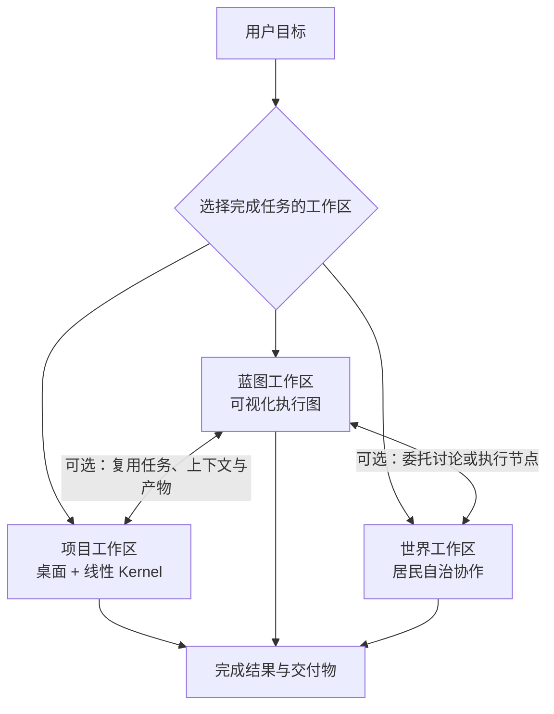

# CosS 蓝图工作区功能文档

## 1. 文档信息

| 项目 | 内容 |
| --- | --- |
| 功能名称 | 蓝图工作区（Blueprint Workspace） |
| 产品定位 | CosS 第三类工作空间入口 |
| 文档类型 | 产品功能文档 / MVP 需求基线 |
| 适用范围 | 桌面端、本地优先、AI 多 Agent 软件协作场景 |
| 建议首发阶段 | 蓝图 MVP |

## 2. 背景与问题

CosS 当前具有两类工作空间：

- **项目工作区**承载真实项目目录、终端、文件、任务、消息和 Kernel 执行过程，解决“在哪里做、由谁执行”的问题。
- **世界工作区**承载 Agent 居民、世界群聊和公告栏任务，解决“Agent 如何组成团队并讨论、认领工作”的问题。

用户仍缺少第三种可完成任务的工作空间：既能像流程图一样看清任务结构，又能让每个节点真正运行。它需要回答：

- 要解决的核心问题是什么，范围和非目标是什么？
- 需求、用户场景、模块、接口、数据和验收标准如何关联？
- 哪些内容尚未确认，哪些决策存在风险或冲突？
- 哪些 Agent、工具和人工审批节点按照什么依赖关系执行？
- 方案如何被审查、形成基线，并直接运行或复用到项目、世界？
- 蓝图运行结果是否完成了用户目标，是否形成了可交付成果？
- 执行结果是否覆盖了原始需求，变更影响到了哪些下游对象？

当前“新建任务 → AI 生成线性步骤 → 确认分派”适合项目工作区的桌面式执行，但不适合表达分支、汇合、条件判断、人工确认、失败重试和可复用子流程。蓝图工作区因此应成为 CosS 的**可视化任务建模与执行工作区**，在自身内部完成从目标输入、任务规划、Agent 执行、过程干预到结果验收的完整闭环。

## 3. 产品定位

### 3.1 一句话定义

蓝图工作区是一个以可执行图谱为核心的完整任务工作区。用户与 Agent 在这里把目标整理成节点和连线，直接运行蓝图、观察各节点产出、处理审批与异常，并最终获得与项目工作区、世界工作区同等级的完成结果和交付物。

### 3.2 三大工作区边界

| 工作区 | 任务完成方式 | 核心对象 | 交互重点 | 最终产出 |
| --- | --- | --- | --- | --- |
| 蓝图工作区 | 可视化执行图驱动 | 执行节点、Agent、工具、依赖、输入输出、验收 | 设计并运行任务流程 | 完成结果、文件、报告、运行记录、验收结论 |
| 项目工作区 | 桌面与 Kernel 线性步骤驱动 | 项目目录、终端、文件、任务、Agent 会话 | 在真实项目环境中逐步实施 | 完成结果、代码/文件、日志、交付物 |
| 世界工作区 | Agent 居民自治协作驱动 | 居民、群聊、公告栏任务、协作记录 | 组队、讨论、认领和协作 | 完成结果、文件、讨论记录、交付物 |

三类工作区都必须能够独立接收用户任务并完成它，差别只在协作与呈现方式。蓝图不是项目工作区中的另一种任务视图，也不是世界工作区中的地图编辑器；它拥有独立运行时、任务目录、Agent 会话、产物和生命周期，也可按需关联项目或世界。

### 3.3 工作区关系



## 4. 产品目标与非目标

### 4.1 产品目标

1. 将自然语言目标转化为结构化、可编辑的方案图谱。
2. 建立“目标 → 需求 → 模块 → Agent/工具任务 → 验收项”的端到端追踪关系。
3. 在蓝图工作区内直接调度 Agent、工具和人工节点，直至完成用户任务。
4. 支持人和 Agent 对方案进行提案、审查、决策和版本基线管理。
5. 在运行前发现缺失、冲突、循环依赖、未覆盖需求和不可验证项。
6. 运行中可观察、暂停、恢复、重试、审批和干预，并保留完整运行记录。
7. 汇总节点结果、文件和验证结论，形成可直接交付给用户的最终成果。
8. 可选地与项目、世界互相委托任务、复用上下文并同步交付物。

### 4.2 首期非目标

- 不替代 Figma、Tiled、UML 专业建模器或通用白板。
- 不提供完全自由的桌面窗口系统；命令和文件修改通过受控的 Agent 节点、工具节点执行。
- 不提供多人云端实时协同；首期保持本地优先，可通过导入导出交换蓝图。
- 不要求首期支持任意复杂控制流；MVP 先支持有向无环图、并行就绪队列和人工审批节点。
- 不根据 Agent 建议自动覆盖已批准内容；所有结构变更必须形成可审查提案。

## 5. 目标用户与核心场景

### 5.1 目标用户

- 产品负责人：梳理目标、范围、用户故事和验收标准。
- 技术负责人：设计模块边界、接口、依赖、风险和技术决策。
- 开发与测试人员：确认执行节点、影响范围、测试覆盖和交付物。
- 独立开发者：通过可视化蓝图让多个 Agent 规划、执行、验证并完成整个任务。

### 5.2 核心场景

1. 用户输入一句目标，AI 生成可执行蓝图，用户确认后点击运行并获得最终成果。
2. 用户导入需求 Markdown，将内容解析为需求、约束和验收节点。
3. 技术负责人补充模块与依赖，系统自动指出未覆盖需求和循环依赖。
4. 多个 Agent 节点按照依赖关系执行，互相消费上游输出，并将文件写入蓝图任务目录或指定项目目录。
5. 流程运行到审批节点时暂停，由用户检查中间结果后批准、驳回或要求重做。
6. 某个节点失败后，用户查看日志、修改输入或提示词并从该节点重试，下游自动失效重算。
7. 验证节点检查完成定义，最终汇总节点生成用户可直接使用的结果与交付物清单。
8. 用户也可把某个节点委托给项目工作区或世界工作区，结果回到原蓝图后继续执行。

## 6. 信息架构

### 6.1 全局入口

左侧主导航新增第三个一级入口：

1. 项目
2. 蓝图
3. Agent 世界

状态字段建议由：

```text
activeSidebarSection: "projects" | "blueprints" | "worlds"
activeBlueprintId: string
blueprints: Blueprint[]
```

### 6.2 蓝图列表区

侧栏切换到“蓝图”后，复用现有项目/世界列表区域，提供：

- 蓝图名称、编辑状态、最近一次运行状态和最近更新时间。
- 关联项目/世界数量。
- 新建、复制、重命名、归档、从列表移除。
- 按状态筛选：草稿、评审中、已批准、已归档。
- 按名称、标签和关联对象搜索。
- 列表为空时显示“创建第一张蓝图”引导。

首期不允许“移除蓝图”直接删除关联项目或世界，也不删除已经生成的项目任务。

### 6.3 主工作区布局

蓝图工作区采用四区布局：

| 区域 | 功能 |
| --- | --- |
| 顶部栏 | 蓝图名称、保存状态、运行/暂停/停止、校验、评审、运行历史、更多操作 |
| 左侧对象面板 | 节点类型、图层、筛选、搜索、导航树 |
| 中央画布 | 节点、关系、实时运行状态、分组、缩放、框选、自动布局、小地图 |
| 右侧检查器 | 节点配置、输入输出、角色/模型/权限、运行结果、日志、产物、关系 |

底部可折叠面板提供“问题 / 运行 / 产物”三个标签，展示校验错误、节点队列、实时日志、Token/耗时、待审批项、最终结果和交付物。

### 6.4 视图体系

所有视图读取同一份蓝图图谱，不复制数据：

- **总览视图**：目标、范围、里程碑和主要模块。
- **运行视图**：执行节点、数据流、控制流、实时状态、重试和人工干预，是默认任务完成视图。
- **需求视图**：用户场景、需求、约束、验收标准及覆盖关系。
- **架构视图**：模块、接口、数据对象、外部系统和依赖。
- **交付视图**：Agent/工具任务、角色、里程碑、依赖、运行结果和进度。
- **风险与决策视图**：风险、问题、假设、决策及影响范围。
- **追踪矩阵**：用表格检查需求、模块、任务、测试和交付物的覆盖。

MVP 首发运行、总览、需求、架构、交付五种视图；其余可后续补充。

## 7. 核心数据对象

### 7.1 蓝图

蓝图基础字段：

- `id`：蓝图唯一标识。
- `name`：蓝图名称。
- `description`：背景与目标摘要。
- `path`：独立保存目录。
- `workingDirectory`：节点实际读写文件的任务目录，可使用蓝图独立目录或用户明确绑定的项目目录。
- `permissionMode`：蓝图执行权限模式，沿用 CosS 的确认/完全访问等策略。
- `status`：`draft | in_review | approved | archived`。
- `lastRunStatus`：`idle | queued | running | waiting_approval | paused | succeeded | failed | cancelled`。
- `version`：当前可读版本号，例如 `0.3`。
- `baselineId`：当前批准基线。
- `createdAt` / `updatedAt` / `lastOpenedAt`。
- `linkedProjectIds` / `linkedWorldIds`。
- `nodes` / `edges` / `views` / `runs` / `artifacts` / `proposals` / `reviews` / `baselines`。

### 7.2 节点类型

节点的完整分类、通用属性、输入输出端口、运行状态和每种节点的专属属性见 [CosS 蓝图工作区节点设计](CosS%20蓝图工作区节点设计.md)。

| 节点 | 用途 | MVP |
| --- | --- | --- |
| 开始 Start | 接收用户目标、附件、运行参数和任务目录，每张可执行蓝图有且仅有一个 | 是 |
| 目标 Goal | 描述业务结果、成功指标和优先级 | 是 |
| 用户场景 Scenario | 描述角色、触发、主流程与预期结果 | 是 |
| 需求 Requirement | 描述功能、规则、约束和优先级 | 是 |
| 验收项 Acceptance | 描述可验证的通过条件 | 是 |
| 模块 Module | 描述系统边界、职责、输入与输出 | 是 |
| Agent 任务 Agent Task | 由指定角色 Agent 执行的最小工作单元，可读写任务目录并产生结构化输出 | 是 |
| 工具 Tool | 执行受控工具操作，如读取文件、搜索、测试或导出 | 是 |
| 人工审批 Approval | 暂停运行，等待用户批准、驳回、修改输入或终止 | 是 |
| 条件 Condition | 根据结构化结果选择后续分支；MVP 仅允许确定性表达式 | 是 |
| 验证 Verifier | 运行测试或依据完成定义检查结果，输出通过/失败及证据 | 是 |
| 汇总 Finalizer | 聚合上游结果和产物，生成面向用户的最终答复 | 是 |
| 里程碑 Milestone | 定义可单独评审与下发的交付范围 | 是 |
| 风险 Risk | 记录概率、影响、应对和责任角色 | 是 |
| 决策 Decision | 记录选项、结论、理由和影响范围 | 是 |
| 接口 Interface | API、事件、协议与契约 | 后续 |
| 数据对象 Data Entity | 关键实体、字段与流向 | 后续 |
| 外部系统 External System | 第三方服务或系统边界 | 后续 |
| 测试 Test | 测试场景、类型和结果 | 后续 |
| 子蓝图 Sub-blueprint | 调用一个已批准、可复用的蓝图并返回其结果 | 后续 |
| 注释 Note | 不参与校验的自由说明 | 是 |

### 7.3 通用节点字段

- 标题、说明、类型、状态、优先级、标签。
- 负责人角色，可引用 CosS 内置角色 ID。
- Agent/工具节点的模型、提示词模板、工作目录权限、超时、重试策略。
- 输入端口、输出端口、输入映射、结构化输出 Schema 和上下文传递策略。
- 来源：手工创建、文档导入、AI 生成、项目回传、世界回传。
- 来源引用：文件路径、原文片段、外部 URL 或消息 ID。
- 验证方式、完成定义和交付物预期。
- 创建、修改和批准时间。
- 执行映射及最后同步状态。

### 7.4 关系类型

| 关系 | 语义 | 示例 |
| --- | --- | --- |
| `contains` | 上级包含下级 | 里程碑包含 Agent 任务 |
| `refines` | 细化 | 需求细化目标 |
| `realizes` | 实现 | 模块实现需求 |
| `depends_on` | 执行或结构依赖 | 模块 A 依赖模块 B |
| `flows_to` | 执行控制流 | Agent 任务完成后进入验证节点 |
| `passes_output` | 将上游指定输出传给下游输入 | 需求分析结果传给实现节点 |
| `blocks` | 阻塞 | 风险阻塞里程碑 |
| `validated_by` | 由某项验证 | 需求由验收项验证 |
| `impacts` | 变更影响 | 决策影响模块 |
| `assigned_to` | 分配给角色 | Agent 任务分配给前端工程师 |
| `traced_to` | 通用追踪 | Agent 任务追踪到需求或受委托项目任务 |

关系必须具有方向、类型和稳定 ID。删除仍被其他对象引用的节点时，应先展示影响范围。

### 7.5 节点状态

节点的审批状态与单次运行状态分离：

```text
draft → ready_for_review → approved
            ↘ rejected       ↓
                    changed → ready_for_review
```

- `changed` 表示节点在批准或运行后发生实质变更，需要重新评审。
- 每次运行中的节点状态为 `idle | blocked | queued | running | waiting_approval | succeeded | failed | skipped | cancelled`。
- 运行状态属于某次 `runId`，不能覆盖节点定义和审批状态。

### 7.6 运行实例

每次点击“运行”创建独立、不可复用 ID 的运行实例：

```text
BlueprintRun = {
  id,
  blueprintId,
  baselineId,
  status,
  input,
  workingDirectory,
  startedAt,
  completedAt,
  nodeRuns[],
  approvals[],
  artifacts[],
  finalResult,
  verificationSummary,
  usage,
  error
}
```

`nodeRuns` 保存每个节点的输入快照、状态、尝试次数、Agent 会话、开始/结束时间、结构化输出、日志引用、产物和错误。重新运行蓝图创建新的运行实例；“从失败节点继续”在同一实例内增加尝试次数并使受影响下游结果失效。

## 8. 功能需求

### 8.1 创建蓝图

点击蓝图列表右上角 `+` 打开新建弹窗，支持以下方式：

1. **空白蓝图**：填写名称和保存目录。
2. **AI 从目标生成**：填写目标、背景、约束和期望交付时间。
3. **关联现有项目**：读取项目名称、目录摘要、项目记忆、近期任务和交付物，生成现状蓝图草案。
4. **从文档导入**：首期支持 Markdown 和纯文本。
5. **从模板创建**：使用本地内置模板，例如新功能、缺陷治理、系统重构。

创建规则：

- 名称和保存目录必填。
- 关联项目/世界为可选项。
- AI 生成失败时仍创建空白蓝图，并保留输入内容和失败提示。
- 导入内容先形成提案预览，用户确认后才写入图谱。

#### 8.1.1 从“新建任务”快速开始

当用户位于蓝图工作区并点击全局“新建任务”时，流程应以完成任务为目标，而不是要求用户先学习画布：

1. 输入任务目标、补充说明、附件、期望交付物和工作目录。
2. AI 自动生成包含 Start、必要 Agent/工具节点、Approval、Verifier 和 Finalizer 的可执行图。
3. 系统展示节点、角色、权限、预计执行路径和完成定义预览。
4. 用户可以直接确认运行，也可以先进入画布调整。
5. 运行完成后直接打开完成页，并将本次图保存为可再次运行的蓝图。

如果用户打开已有蓝图后点击“新建任务”，则复用该蓝图定义，只收集本次运行输入并创建新的 `BlueprintRun`。这样既支持一次性任务，也支持沉淀可重复使用的标准流程。

### 8.2 画布编辑

中央画布应支持：

- 新建、复制、删除、移动、折叠节点。
- 从节点连接点拖拽建立有类型的关系。
- 框选、多选、对齐、分布、批量修改状态或标签。
- 画布平移、缩放、适应视图、定位选中节点和小地图。
- 按里程碑或模块创建分组框，分组只负责展示，不改变真实关系。
- 自动布局：层级布局和依赖布局。
- 撤销/重做，MVP 至少保留当前打开会话内的 50 步。
- 自动保存，并明确显示“已保存 / 保存中 / 保存失败”。

删除、批量修改、接受 AI 提案等操作必须进入撤销栈。删除已有运行记录或外部委托映射的节点时需要二次确认，但不级联删除历史运行和项目任务。

### 8.3 属性检查器

右侧检查器根据选中对象切换：

- 单个节点：编辑全部字段、关系、来源、评论和映射。
- 多个节点：批量编辑状态、优先级、标签和负责人。
- 关系：修改关系类型、说明和方向。
- 无选中对象：编辑蓝图说明、目标、关联对象和默认布局。

字段修改应实时保存；标题、类型、关系、验收条件、负责人等实质字段变更需要记录版本差异。

### 8.4 AI 蓝图助手

蓝图助手提供以下能力：

- 根据目标生成蓝图草案。
- 将选中节点继续拆解为需求、模块、Agent/工具任务或验收项。
- 识别模糊需求、冲突、遗漏、重复节点和不可验证表述。
- 为选中范围补充验收标准、风险和依赖。
- 根据已有项目记忆提出“现状与目标差距”。
- 回答“某节点为什么存在、来自哪里、影响什么”。
- 将自然语言修改转成结构化变更提案。

AI 修改规则：

1. 默认只生成提案，不直接修改当前蓝图。
2. 提案必须显示新增、修改、删除节点和关系的差异。
3. 用户可整批接受、逐项接受或拒绝。
4. 已批准或已经运行的范围发生 AI 修改时必须进入重新评审状态。
5. 发送给模型的项目内容和文件摘要应沿用现有模型配置与隐私边界。

### 8.5 图谱校验

点击“校验蓝图”后执行确定性规则，AI 建议作为独立结果展示。

MVP 必须包含：

- 蓝图至少有一个目标。
- 可执行蓝图必须且只能有一个 Start 节点，并至少有一个 Finalizer 节点。
- 每个已批准需求至少关联一个验收项。
- 每个准备运行的 Agent 任务必须有标题、说明、负责人角色、允许的工作目录和完成定义。
- 每个准备运行的工具节点必须使用白名单工具并具有有效参数。
- 每个准备运行的 Agent/工具任务必须直接或间接追踪到目标或需求。
- 检测必需输入未连接、输出类型不兼容、不可达节点和没有出口的执行分支。
- 检测条件分支是否覆盖默认路径，Finalizer 是否能取得必需结果。
- 检测 `depends_on` 中的循环依赖。
- 检测无入边、无出边且不属于注释的孤立节点。
- 检测已删除或失效的项目、世界、任务映射。
- 检测批准后发生变化但尚未重新评审的节点。
- 检测同一蓝图内重复的执行映射。

问题等级：

- **错误**：阻止批准或运行。
- **警告**：允许继续，但必须展示确认。
- **建议**：不阻断流程。

点击问题应自动定位并高亮相关节点；支持忽略建议，但忽略必须记录原因。

### 8.6 评审与批准

评审流程：

1. 用户选择整个蓝图或一个里程碑发起评审。
2. 系统先运行确定性校验。
3. 用户可选择产品经理、技术负责人、测试工程师等 Agent 生成评审意见。
4. 意见以评论或结构化提案返回，不直接更改蓝图。
5. 所有阻断问题处理后，用户执行“批准并建立基线”。

评审状态：`未开始 / 评审中 / 需修改 / 已通过`。

首期批准权属于本地用户。Agent 可以建议通过或驳回，但不能替代用户建立批准基线。

### 8.7 版本、基线与差异

- 自动保存形成工作版本，不为每次输入创建正式版本号。
- 用户批准时创建不可变基线，记录节点、关系、关联对象和校验结果快照。
- 支持查看当前工作版本与任意基线的差异。
- 差异分类：新增、修改、删除、关系变化、映射变化。
- 支持从历史基线复制出新工作版本；不直接覆盖现有项目执行结果。
- 已运行或已委托范围发生变更时，标记原结果为“基线已过期”，提示从受影响节点重新运行或生成变更任务。

### 8.8 直接运行蓝图

蓝图工作区的主操作是“运行”，不是“下发”。一个可执行蓝图必须能在自身工作区内完成用户任务。

#### 8.8.1 运行前确认

点击“运行蓝图”后展示运行确认页：

- 本次用户目标、补充输入和附件。
- 使用当前工作版本或已批准基线；默认推荐已批准基线。
- 工作目录：蓝图独立任务目录，或用户明确选择的现有项目目录。
- 将参与的 Agent 角色、模型、工具和预计并发数。
- 权限模式、外部访问、风险操作和人工审批点。
- 将要执行、跳过或复用缓存的节点。
- 阻断错误、警告及预期完成定义。

用户确认后才创建 `BlueprintRun`。草稿蓝图允许试运行，但必须显示“未批准版本”，高风险操作仍按权限规则审批。

#### 8.8.2 执行调度

- 系统从 Start 节点开始，根据 `flows_to`、`depends_on` 和条件分支计算就绪队列。
- 所有必需上游成功后节点才能进入 `queued`；上游失败时默认保持 `blocked`。
- 无依赖冲突的 Agent/工具节点可以并行执行；MVP 默认并发上限为 3，可在运行确认页降低。
- 多节点修改同一资源时沿用 CosS 资源锁；无法取得锁的节点等待，不并发写入。
- Agent 任务节点使用现有 Agent Provider、角色提示词、终端适配器和输出追踪能力，但会话与项目/世界会话隔离。
- 每个节点只获得显式输入、必要上游输出、蓝图任务目标、允许的文件范围和自身角色说明，避免无边界上下文膨胀。
- 工具节点只能调用白名单工具；Shell 类操作必须受权限模式和风险审批控制。
- 条件节点只读取结构化字段，不能执行任意脚本。

#### 8.8.3 输入输出传递

- 节点可声明 `text`、`json`、`file`、`artifact-list`、`boolean` 等输入输出端口。
- `passes_output` 关系明确指定“上游哪个输出 → 下游哪个输入”。
- 输出不符合 Schema 时节点失败，并展示实际输出和期望结构。
- 大文件只传路径、摘要和内容哈希，不把完整内容重复注入所有 Agent。
- 最终汇总节点可读取所有标记为 `deliverable` 的输出和产物。

#### 8.8.4 运行观察与控制

运行期间画布实时显示：

- 节点状态、进度、耗时、重试次数、当前 Agent 和资源锁状态。
- 连线上的输入传递是否完成，条件分支实际选择哪条路径。
- 底部运行面板中的队列、实时日志、待审批项、Token/费用摘要和产物。

用户可以：

- 暂停调度：不再启动新节点，已运行节点可选择继续或中止。
- 恢复运行。
- 停止整次运行并保留已有结果。
- 重试失败节点；其下游旧结果自动标为失效。
- 修改节点输入后从该节点继续。
- 对非必需节点执行跳过，并填写原因。
- 打开节点详情查看完整输入、输出、日志和产物。

运行中的结构编辑默认进入下一版本，不影响当前运行快照。需要改变当前运行时，必须通过“修改输入并重试”或停止后重新运行。

#### 8.8.5 人工审批与高风险动作

- Approval 节点到达后整条相关分支进入 `waiting_approval`。
- 审批卡展示上游结果、拟执行动作、文件差异、风险说明和下游影响。
- 用户可批准、驳回、要求重做、修改参数或终止运行。
- Agent 不能代替用户通过人工审批节点。
- 系统检测到删除数据、外部发布、付款、发送外部消息等高风险操作时，即使蓝图未配置 Approval 节点，也必须插入运行时审批门。

#### 8.8.6 失败恢复

- 节点可配置最大重试次数、超时和退避策略；默认不无限重试。
- Agent/工具进程异常、输出不合规、测试失败和权限拒绝必须使用不同错误码。
- 失败时保留输入、已产生文件、日志和错误摘要，不静默吞掉部分产出。
- 用户可从失败节点继续、回退到指定节点重新计算，或终止并复制为修订蓝图。
- 从上游重跑时，所有依赖其输出的下游节点标为 `stale`，必须重新运行或由用户明确确认复用。

#### 8.8.7 任务完成与最终交付

一次蓝图运行满足以下条件时标记为 `succeeded`：

1. 所有必需执行节点成功，或按规则完成了合法条件分支。
2. 所有必需 Verifier 节点通过。
3. 没有未处理的人工审批、阻断错误或失效下游结果。
4. Finalizer 节点生成最终答复，包括完成内容、关键结果、交付物、验证证据和已知限制。
5. 交付物已写入任务目录并建立可打开的产物索引。

如果实现已完成但没有配置验证节点，运行可标记为 `succeeded_with_warnings`，界面必须明确显示“未验证”，不能伪装为已验收。

完成页应与其他工作区提供同等级结果：

- 面向用户的最终答复。
- 新建或修改的文件清单。
- 报告、图片、文档、代码等可打开交付物。
- 验证命令、测试结果和证据。
- 各节点执行摘要、失败重试和审批记录。
- 继续修改、重新运行、导出结果或基于本次运行创建新蓝图的入口。

### 8.9 可选委托到项目工作区

蓝图可以独立完成任务，也允许把某个 Agent 任务节点委托给项目工作区，以复用已有项目桌面和线性 Kernel。委托不是完成蓝图任务的必经步骤。

操作流程：

1. 将 Agent 任务节点的执行方式设为“项目委托”。
2. 选择目标项目，并预览将创建的 Kernel 线性步骤。
3. 用户确认后创建项目任务和蓝图映射，该蓝图节点进入等待外部结果状态。
4. 项目完成后，结果、验证证据与交付物作为节点输出返回，蓝图继续调度下游节点。

委托约束：

- 委托节点必须具有明确输入、负责人、完成定义和输出 Schema。
- 重复委托时提示“复用现有任务 / 创建新版本任务 / 取消”。
- 蓝图委托不会绕过项目任务计划确认、权限、资源锁和审批机制。

建议映射字段：

```text
executionLinks[] = {
  id,
  blueprintNodeId,
  baselineId,
  targetType: "project-task" | "project-subtask" | "world-task",
  targetWorkspaceId,
  targetTaskId,
  targetStepId,
  dispatchVersion,
  syncStatus,
  createdAt,
  lastSyncedAt
}
```

### 8.10 可选委托到世界工作区

世界委托适合开放式讨论、方案补充、模块认领或居民自治执行：

1. 选择目标、里程碑或存在争议的节点范围。
2. 选择目标世界及参与群聊的居民角色。
3. 系统生成公告栏任务，包含背景、待讨论问题、约束、期望输出和蓝图引用。
4. 世界 Agent 通过群聊形成结论、风险、模块认领或修改建议。
5. 结果按节点配置回传为蓝图提案或执行输出；提案需用户接受，执行输出则进入后续验证节点。

世界结果不得直接把整个蓝图标记为成功。只有结果回传、后续必需节点完成且最终验证通过后，蓝图运行才能成功。

### 8.11 执行状态与跨工作区同步

蓝图工作区直接维护自身节点运行状态，并只读同步受委托的项目/世界任务状态：

- `未运行 / 已排队 / 执行中 / 等待审批 / 已完成 / 已失败 / 已取消 / 已过期`。
- 本地执行节点直接展示运行日志、Agent 会话、结构化输出和交付物。
- 节点显示本地或受委托任务进度、最后执行 Agent 和最后同步时间。
- 右侧检查器展示对应任务、步骤、日志入口和交付物。
- 受委托任务完成后，将结果摘要和产物引用回填到对应节点。
- 验收步骤通过后，可将对应验收项标为“已验证”；失败时保留失败原因。
- 蓝图节点被修改后，不反向静默改写正在执行的项目任务，而是产生“同步差异”。

### 8.12 追踪矩阵

追踪矩阵用于回答“每项需求是否被设计、实现和验证”：

| 需求 | 场景 | 模块 | 执行节点 | 验收项 | 运行/委托任务 | 交付物 | 状态 |
| --- | --- | --- | --- | --- | --- | --- | --- |

支持：

- 按里程碑、状态、负责人和标签筛选。
- 高亮未覆盖、部分覆盖和已覆盖。
- 点击单元格返回画布节点或打开关联项目任务。
- 导出 Markdown 或 CSV。

### 8.13 评论、问题与决策

- 用户和评审 Agent 可对节点或关系添加评论。
- 评论支持待处理、已解决状态，并保留解决说明。
- 评论可以转换为风险、决策或 Agent 任务节点。
- 决策必须记录背景、候选方案、最终选择、理由、日期和影响节点。
- 修改已批准决策时自动将相关范围标记为 `changed`。

### 8.14 搜索、筛选与导航

- 全文搜索标题、说明、标签、评论和来源。
- 按节点类型、审批状态、运行状态、优先级、负责人、里程碑和执行位置筛选。
- 上下游追踪：仅显示当前节点的一层或全部祖先/后代。
- “聚焦模式”隐藏无关节点。
- 全局搜索结果支持从项目、世界直接跳转到关联蓝图节点。

### 8.15 导入导出

MVP：

- 导入 Markdown、纯文本和 CosS 蓝图 JSON。
- 导出 CosS 蓝图 JSON、Markdown 方案和 Mermaid 关系图。
- JSON 是可恢复编辑的标准格式；Markdown 和 Mermaid 是只读交付格式。
- 导入 JSON 前校验版本、ID 冲突和外部映射，失效映射默认断开。

后续：PNG、PDF、CSV 追踪矩阵及第三方需求工具导入。

## 9. 关键交互流程

### 9.1 在蓝图工作区完成用户任务

```text
进入蓝图列表
→ 新建蓝图
→ 输入目标或导入文档
→ AI 生成草案提案
→ 用户审查并接受
→ 补充需求、模块、执行节点、验收项
→ 校验蓝图
→ 发起评审
→ 批准并建立基线
→ 确认本次输入、任务目录和权限
→ 运行蓝图
→ Agent 与工具节点按依赖执行
→ 用户处理人工审批和异常
→ 验证节点检查完成定义
→ 汇总节点生成最终答复与交付物
→ 用户查看、打开或导出成果
```

### 9.2 需求变更

```text
修改已批准需求
→ 节点及下游标记 changed
→ 展示受影响模块、执行节点、运行实例、委托任务和验收项
→ 用户确认变更范围
→ 重新校验与评审
→ 建立新基线
→ 从受影响节点重新运行
```

### 9.3 发布世界讨论

```text
选择争议节点
→ 发布到世界
→ 选择群聊成员和期望输出
→ Agent 讨论与认领分析模块
→ 世界返回结构化提案
→ 用户在蓝图中逐项接受或拒绝
```

## 10. 状态与持久化建议

### 10.1 应用级状态

```js
{
  activeProjectId: "",
  projects: [],
  activeBlueprintId: "",
  blueprints: [],
  activeWorldId: "",
  worlds: [],
  activeSidebarSection: "projects"
}
```

状态归一化必须兼容旧数据：不存在 `blueprints` 时初始化为空数组，不存在 `activeBlueprintId` 时初始化为空字符串，未知侧栏值回退为 `projects`。

### 10.2 蓝图文件结构

建议每张蓝图使用独立目录：

```text
<blueprint-path>/
├── blueprint.json          # 当前工作版本
├── baselines/              # 不可变批准基线
├── imports/                # 可选的导入来源快照或引用信息
├── exports/                # 用户主动生成的导出文件
├── attachments/            # 蓝图附件
├── runs/                   # 每次运行的状态、节点输出与日志引用
└── artifacts/              # 运行产生并建立索引的交付物
```

应用全局状态仅保存蓝图索引和最近打开信息；完整图谱保存在蓝图目录。SQLite 可继续保存索引、事件和搜索字段，但 JSON 文件应保持可迁移、可备份和可审计。

### 10.3 事件记录

至少记录：

- `blueprint.created / opened / archived`
- `blueprint.node.created / updated / deleted`
- `blueprint.edge.created / updated / deleted`
- `blueprint.proposal.generated / accepted / rejected`
- `blueprint.validation.completed`
- `blueprint.review.started / completed`
- `blueprint.baseline.created`
- `blueprint.run.started / paused / resumed / completed / failed / cancelled`
- `blueprint.node.queued / started / completed / failed / retried / skipped`
- `blueprint.approval.requested / approved / rejected`
- `blueprint.artifact.created`
- `blueprint.dispatch.project / dispatch.world`
- `blueprint.execution.synced`

事件中避免写入 API Key、终端原始输出和大段文件内容。

## 11. 权限、安全与数据边界

- 蓝图 Agent 默认只能读取蓝图数据、本次节点输入和明确授权的工作目录。
- 绑定现有项目目录或读取额外文件前必须展示实际路径与访问范围。
- 蓝图运行时可以通过 Agent 节点和工具节点启动受控会话、修改文件与执行命令，并沿用 CosS 权限模式、资源锁、审批、日志和输出追踪机制。
- 节点不得因为画布连线自动扩大权限；上游传递的是数据，不是权限。
- 委托项目后，由项目工作区原有权限模式、资源锁和审批机制接管。
- 发布世界后，由世界独立会话权限边界接管。
- 外部 URL、附件和导入文件只作为数据处理，不执行其中命令。
- 删除蓝图采用“从列表移除 / 移至回收站”优先；永久删除前展示目录、基线、附件和映射数量。
- 所有 AI 建议保留来源、模型、生成时间和接受人。

## 12. 异常与边界处理

| 场景 | 处理方式 |
| --- | --- |
| 蓝图保存目录不可访问 | 进入只读模式，允许另存为，不丢弃内存中的编辑 |
| AI 生成失败 | 保留用户输入，允许重试或创建空白蓝图 |
| 导入内容过大 | 展示大小限制，支持选择章节或分批导入 |
| 节点或关系数据损坏 | 隔离无效对象，展示恢复报告，不阻止读取其余内容 |
| 关联项目被移除 | 映射标记失效，保留历史 ID 和最后同步快照 |
| 项目任务被删除 | 标记为“目标已删除”，不删除蓝图节点 |
| 世界不存在或无群聊成员 | 禁止发布并引导选择世界或加入成员 |
| 执行图存在无出口循环 | 高亮依赖环并禁止运行；允许的重试由节点重试策略表达 |
| 执行中蓝图发生变更 | 当前运行继续使用启动快照，新改动进入下一版本 |
| Agent 节点超时或崩溃 | 保留日志和部分产物，按有限重试策略处理后等待用户决定 |
| 上游输出不符合 Schema | 节点失败并展示字段差异，不启动依赖该输出的下游 |
| 用户关闭应用 | 持久化运行快照；重启后提示恢复、标记中断或重新运行未完成节点 |
| 外部状态刷新冲突 | 以稳定 ID 合并，无法自动合并时生成冲突提案 |

## 13. 非功能要求

### 13.1 性能

- 500 个节点、1,000 条关系下，常用平移缩放保持可交互。
- 蓝图首次打开目标在 2 秒内完成基础数据渲染，不包含外部模型调用。
- 自动保存采用防抖和增量脏标记，连续输入不应频繁写盘。
- 大图自动布局在后台执行，期间不锁死主界面。

### 13.2 可靠性

- 保存使用临时文件加原子替换，避免异常退出产生半写文件。
- 保留最近成功保存快照和至少 10 个基线/备份恢复点。
- 稳定 ID 不因布局、重命名或导出发生变化。
- 节点启动、结果提交、产物索引和跨工作区映射应具备幂等性，避免恢复或重复点击造成重复执行。
- 应用异常退出后能够识别运行中的节点；不能把未知状态误报为成功。

### 13.3 可用性与可访问性

- 节点类型不能只依赖颜色区分，还需图标和文字标签。
- 支持键盘选择、移动、删除、撤销、重做、搜索和适应视图。
- 关键状态变化提供文字反馈，错误说明包含可执行的恢复操作。
- 所有新增文案纳入现有多语言体系；MVP 至少完成简体中文和英文。

## 14. MVP 范围与演进计划

### 14.1 P0：蓝图 MVP

- 第三类侧栏入口、蓝图列表、新建/打开/重命名/移除。
- 独立蓝图目录和兼容旧状态的数据模型。
- 运行、总览、需求、架构、交付五类视图。
- Start、目标、场景、需求、验收、模块、Agent 任务、工具、审批、条件、验证、汇总、里程碑、风险、决策、注释节点。
- 节点/关系编辑、检查器、搜索筛选、自动保存、撤销重做。
- 确定性校验与问题定位。
- AI 生成草案、拆解节点、差异提案及人工接受。
- 评审、批准基线和版本差异。
- 蓝图运行实例、DAG 就绪队列、最多 3 个节点并发和资源锁。
- Agent/工具节点执行、结构化输入输出和受控任务目录读写。
- 运行/暂停/恢复/停止、节点重试、跳过和下游失效重算。
- 人工审批、失败恢复、验证节点、最终汇总和完成页。
- 节点日志、运行历史、最终结果和交付物索引。
- 可选委托到项目并回收状态、结果和交付物。
- JSON、Markdown、Mermaid 导入导出。

### 14.2 P1：跨工作区协作

- 委托到世界及结构化提案/执行结果回传。
- 追踪矩阵完整交互和 CSV 导出。
- 需求变更影响分析、“仅重跑差异”以及按需委托变更节点。
- 评论线程、评论转 Agent 任务/风险/决策。
- 接口、数据对象、外部系统和测试节点。
- 蓝图模板管理。

### 14.3 P2：高级能力

- 多项目组合蓝图与跨项目里程碑。
- 条件循环、动态节点、子蓝图和更高级的并行调度。
- 语义搜索、重复需求检测和架构规则插件。
- 云端多人实时协同、权限与审批流。
- 第三方需求、代码托管和设计工具双向同步。

## 15. MVP 验收标准

### 15.1 入口与生命周期

- 左侧栏显示“项目 / 蓝图 / Agent 世界”三个入口，切换后列表和主工作区正确更新。
- 可创建独立保存目录的蓝图，重启应用后能够恢复列表、活动蓝图和画布内容。
- 删除或移除蓝图不会影响关联项目、世界和已创建任务。

### 15.2 建模

- 用户可创建 MVP 节点类型并建立有方向、有类型的关系。
- 可通过画布与检查器编辑节点，支持搜索、筛选、撤销和重做。
- 切换不同视图时读取同一节点，字段修改不会产生重复副本。

### 15.3 AI 与评审

- 输入自然语言目标后可生成结构化提案，失败时可回退空白蓝图。
- AI 提案在接受前不改变当前图谱；用户可逐项接受或拒绝。
- 蓝图存在阻断错误时无法批准；校验项可定位到相关节点。
- 批准后创建不可变基线，修改批准节点会显示差异并标记 `changed`。

### 15.4 直接运行与完成结果

- 用户可为蓝图选择独立任务目录或明确绑定项目目录，并在运行前确认权限和参与角色。
- 循环依赖、缺失执行入口、缺失汇总节点、必需输入未连接或缺失完成定义时禁止运行并明确提示原因。
- Agent 和工具节点能按照依赖关系执行；并行节点不会绕过资源锁。
- 用户可以暂停、恢复、停止和重试，并能查看每个节点的输入、输出、日志、错误和产物。
- Approval 节点及运行时高风险审批必须等待用户决定，Agent 无法自行通过。
- 上游重跑后，依赖旧输出的下游结果会失效，不得继续作为最新结果交付。
- 所有必需验证通过且 Finalizer 生成结果后，运行才标记成功。
- 完成页提供最终答复、文件和交付物、测试证据、已知限制及运行摘要，最终效果与另外两种工作区一致。

### 15.5 跨工作区委托

- Agent 任务节点可选委托到项目或世界，但委托不是蓝图完成任务的必需条件。
- 委托任务的结果能回到原节点并触发后续调度。
- 每个委托任务都能回溯到蓝图节点、运行实例和基线。
- 外部工作区失败、取消或映射失效时，蓝图节点进入明确的失败或阻塞状态。

### 15.6 安全与兼容

- 旧版没有蓝图字段的状态文件可以正常启动，并默认进入项目工作区。
- 蓝图执行命令必须通过受控 Agent/工具节点，遵守权限、锁和审批，不提供无审计的任意执行通道。
- AI、文件、保存和同步失败均有明确错误状态，且不导致已保存蓝图丢失。

## 16. 建议测试范围

### 16.1 单元测试

- 蓝图状态归一化、节点/关系模型和稳定 ID。
- 图谱校验、循环依赖检测和覆盖率计算。
- DAG 就绪队列、并发限制、条件分支和资源锁调度。
- 输入输出 Schema、端口映射和下游失效传播。
- 节点重试、超时、暂停恢复和运行实例状态机。
- 基线快照、差异计算和变更传播。
- 执行映射幂等与失效映射处理。
- JSON 导入版本兼容和冲突 ID 重写。

### 16.2 端到端测试

- 创建蓝图、编辑节点、保存、重启恢复。
- AI 生成成功、失败回退、逐项接受提案。
- 校验失败、问题定位、修复后批准。
- 从用户目标生成蓝图、直接运行多个 Agent 节点、通过验证并显示最终交付物。
- 并行节点资源竞争、人工审批、节点超时、失败重试和从中断恢复。
- 委托项目/世界、等待结果、结果回填并继续下游运行。
- 关联项目被移除后的只读历史映射。
- 大图缩放、筛选、自动布局和保存期间的交互。
- 多语言切换及空状态、错误状态和只读状态。

## 17. 成功指标

首发后重点观察：

- 蓝图创建后完成首次批准的比例。
- 用户在蓝图工作区内直接完成任务的比例。
- 蓝图运行成功率、失败恢复成功率和任务完成中位耗时。
- 运行前被校验发现并修复的问题数量。
- 已批准需求的执行覆盖率和验收覆盖率。
- 最终结果具有可打开交付物和验证证据的比例。
- 人工审批响应时长、节点平均重试次数和无效下游重算比例。
- 因需求变更产生的差异任务中，可追踪到原始蓝图节点的比例。
- AI 提案的接受、部分接受和拒绝比例。

## 18. 产品结论

蓝图工作区应以“可执行任务图谱 + Agent/工具运行时 + 人工审批 + 验证交付”为核心，而不是做成通用白板或仅供规划的中间层。它是能够独立完成用户任务的第三大工作区：

- 向上接收自然语言目标、文档和 Agent 提案。
- 向内完成需求、架构、风险、验收和决策建模，并把它们连接为可运行节点。
- 直接调度 Agent、工具、条件和人工审批节点完成任务。
- 在运行中提供状态观察、失败恢复、日志和产物管理。
- 通过验证与汇总节点向用户交付最终答复、文件、报告和证据。
- 可选地把单个节点委托给项目或世界，再收回结果继续执行。

三类工作区具有同等的任务完成能力，但体验不同：**项目工作区用桌面做，蓝图工作区按图运行，世界工作区由居民协作。**
