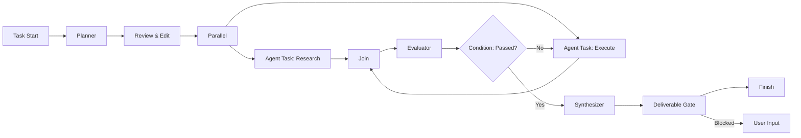

# CosS 蓝图工作区节点设计

## 1. 文档目标

本文定义蓝图工作区的节点语言，包括：

- 节点分类与完整节点清单。
- 每种节点的功能、输入、输出和专属属性。
- 所有节点共有的属性、端口、连线、状态和错误规则。
- AI Agent、工具调用、人工介入、控制流和可靠执行如何组合。
- MVP 节点范围与后续扩展优先级。

这套节点体系不依赖项目工作区或世界工作区。蓝图本身就是完整任务运行环境，必须能从用户输入开始，经过规划、执行、检查和人工决策，最终生成可交付结果。

## 2. 设计原则

### 2.1 节点是契约，不只是卡片

每个节点都必须同时声明：

1. 接收什么输入。
2. 执行什么行为。
3. 允许访问什么资源。
4. 产生什么结构化输出。
5. 什么条件算成功。
6. 失败是否重试、转移或终止。
7. 是否会产生外部副作用。

### 2.2 控制流与数据流分离

- 控制流回答“下一步运行谁”。
- 数据流回答“把什么结果传给谁”。
- 错误流回答“失败后由谁处理”。
- 反馈流回答“下一轮迭代把什么送回上游”。

用户不能仅凭一根含义不清的连线同时表达四种语义。

### 2.3 默认显式上下文

下游 Agent 默认只收到：

- 本次用户任务。
- 当前节点配置。
- 明确连接的上游输出。
- 明确授权的文件与记忆。

蓝图不默认把全部历史、全部文件和所有节点输出塞给每个 Agent。这样可以降低上下文污染、Token 浪费和越权风险。

### 2.4 副作用必须可审计

读取可以宽松，写入必须明确。修改文件、运行命令、调用外部 API、发消息、发布内容和删除数据的节点必须声明副作用等级、权限范围和幂等策略。

### 2.5 运行可恢复

每个节点完成后保存检查点。应用退出、Agent 崩溃或网络中断后，应从最近的稳定节点恢复，而不是从头执行整个蓝图。

### 2.6 AI 建议与确定性控制分离

- Agent 可以分析、生成、审查和提出路由建议。
- 条件、计数、权限、预算和最终成功判断优先使用确定性规则。
- AI 路由必须显式标记为“语义判断”，并保留置信度和理由。

## 3. 节点总体分类

完整节点库设计为 7 类、40 个节点。

| 分类 | 节点数量 | 解决的问题 |
| --- | ---: | --- |
| 生命周期节点 | 4 | 任务如何开始、成功结束或失败结束 |
| AI 智能节点 | 7 | 如何规划、执行、协商、压缩上下文、评价和汇总 |
| 工具与动作节点 | 8 | 如何操作文件、终端、浏览器、API、应用和交付物 |
| 数据处理节点 | 7 | 如何创建、变换、拆分、合并和验证数据 |
| 流程控制节点 | 8 | 如何分支、并行、循环、等待和复用子蓝图 |
| 人工与治理节点 | 4 | 如何向用户提问、审批、编辑和执行质量门 |
| 可靠性节点 | 2 | 如何捕获错误和执行补偿 |

## 4. 所有节点的通用属性

### 4.1 标识与展示属性

| 属性 | 类型 | 必填 | 说明 |
| --- | --- | --- | --- |
| `id` | string | 是 | 蓝图内稳定唯一 ID，复制节点时生成新 ID |
| `type` | string | 是 | 节点运行时类型，如 `ai.agent` |
| `typeVersion` | integer | 是 | 节点定义版本，用于迁移 |
| `name` | string | 是 | 画布显示名称 |
| `description` | string | 否 | 节点职责与使用说明 |
| `tags` | string[] | 否 | 搜索、筛选和治理标签 |
| `groupId` | string | 否 | 所属分组或泳道 |
| `position` | object | 是 | 画布坐标 |
| `size` | object | 否 | 自定义宽高 |
| `collapsed` | boolean | 否 | 是否折叠 |
| `disabled` | boolean | 否 | 禁用后不参与新运行 |
| `notes` | markdown | 否 | 面向蓝图维护者的说明 |

### 4.2 输入输出属性

| 属性 | 类型 | 说明 |
| --- | --- | --- |
| `inputPorts[]` | Port[] | 输入端口定义 |
| `outputPorts[]` | Port[] | 输出端口定义 |
| `inputMappings` | Mapping[] | 上游输出、运行参数、变量到输入字段的映射 |
| `outputSchema` | JSON Schema | 节点成功输出必须满足的结构 |
| `allowPartialInput` | boolean | 是否允许部分可选输入缺失 |
| `streamingOutput` | boolean | 是否支持流式输出 |
| `artifactDeclarations[]` | ArtifactContract[] | 预期产生的文件或交付物 |

### 4.3 执行属性

| 属性 | 类型 | 默认值 | 说明 |
| --- | --- | --- | --- |
| `executor` | enum | auto | local、agent、tool、human、external |
| `priority` | integer | 0 | 同时就绪时的调度优先级 |
| `timeoutMs` | integer | 类型默认值 | 单次尝试超时 |
| `retryPolicy` | object | 有限重试 | 最大次数、退避、可重试错误码 |
| `cachePolicy` | enum | off | off、run、blueprint、content-addressed |
| `idempotencyKey` | expression | 自动生成 | 防止恢复时重复产生外部副作用 |
| `concurrencyKey` | string | 空 | 相同 key 的节点串行执行 |
| `resourceLocks[]` | string[] | 空 | 运行前需要取得的资源锁 |
| `continueOnError` | boolean | false | 失败是否仍允许普通控制流继续 |
| `required` | boolean | true | 跳过此节点是否仍可完成蓝图 |

### 4.4 Agent 与上下文属性

| 属性 | 类型 | 说明 |
| --- | --- | --- |
| `role` | string | Agent 角色或自定义身份 |
| `modelProfile` | string | 模型配置引用，不直接保存密钥 |
| `systemInstructions` | text | 节点级系统约束 |
| `contextPolicy` | object | 允许读取的上游、文件、记忆和最大 Token |
| `memoryReadScopes[]` | string[] | 可读取的记忆命名空间 |
| `memoryWriteScope` | string | 允许写入的记忆命名空间 |
| `toolAllowlist[]` | string[] | Agent 可调用工具白名单 |
| `maxTurns` | integer | Agent 最大内部轮次 |
| `handoffPolicy` | enum | 禁止、建议、自动请求人工确认 |

### 4.5 权限与副作用属性

| 属性 | 类型 | 说明 |
| --- | --- | --- |
| `sideEffectLevel` | enum | none、read、write-local、external、destructive |
| `permissionProfile` | string | 权限策略引用 |
| `fileScopes[]` | PathScope[] | 可读、可写、禁止访问的路径 |
| `networkScopes[]` | NetworkScope[] | 可访问域名、方法和端口 |
| `credentialRefs[]` | string[] | 凭据引用，只能由运行时解析 |
| `requiresApproval` | boolean/expression | 运行前是否必须审批 |
| `redactionPolicy` | object | 日志和输出中的敏感字段脱敏 |
| `auditLevel` | enum | minimal、standard、full |

### 4.6 质量与可观察属性

| 属性 | 类型 | 说明 |
| --- | --- | --- |
| `completionCriteria[]` | Rule[] | 节点成功的确定性或人工条件 |
| `qualityRubric` | Rubric | AI 评价维度与分值 |
| `logLevel` | enum | error、info、debug、trace |
| `emitProgress` | boolean | 是否持续上报进度 |
| `retainInputs` | boolean | 是否保留输入快照 |
| `retainOutputs` | boolean | 是否保留输出 |
| `retentionDays` | integer | 节点运行数据保留时间 |
| `costLimit` | object | Token、金额和时间上限 |

## 5. 端口与连线设计

### 5.1 端口属性

每个 `Port` 包含：

| 属性 | 说明 |
| --- | --- |
| `id` / `label` | 稳定 ID 与显示名 |
| `direction` | input 或 output |
| `kind` | control、data、error、feedback |
| `dataType` | text、number、boolean、json、table、file、artifact、image、audio、video、event、any |
| `schema` | 更精确的 JSON Schema |
| `cardinality` | one、optional、many、stream |
| `required` | 运行前是否必须连接或提供值 |
| `secret` | 敏感值标记；secret 数据禁止写入普通日志 |
| `description` | 端口语义 |

### 5.2 四种连线

| 连线 | 视觉 | 功能 |
| --- | --- | --- |
| 控制线 | 灰色实线 | 上游完成后激活下游，不自动传全部数据 |
| 数据线 | 蓝色实线 | 把指定输出端口映射到指定输入端口 |
| 错误线 | 红色实线 | 节点失败、超时或取消后进入异常处理路径 |
| 反馈线 | 紫色虚线 | 仅用于受控循环，把评价或修订要求送回前序节点 |

### 5.3 执行数据包

节点之间传递的不是任意隐式对象，而是统一 `ExecutionPacket`：

```json
{
  "packetId": "packet_xxx",
  "runId": "run_xxx",
  "sourceNodeId": "node_xxx",
  "correlationId": "item_xxx",
  "payload": {},
  "artifacts": [],
  "evidence": [],
  "variables": {},
  "provenance": {},
  "error": null
}
```

- `packetId` 用于追踪数据经过哪些节点。
- `correlationId` 用于 Split、For Each 与 Join 保持数据对应关系。
- 文件通过引用传递，包含路径、哈希、MIME 类型和生成节点。
- 凭据只以引用存在，永不作为数据包明文传递。

### 5.4 上下文作用域

| 作用域 | 生命周期 | 用途 |
| --- | --- | --- |
| Node Context | 单节点多次尝试 | 游标、局部缓存和增量进度 |
| Run Context | 单次蓝图运行 | 本次输入、变量和中间结果 |
| Blueprint Context | 多次运行 | 蓝图配置、经过批准的固定知识 |
| Memory Vault | 跨蓝图 | 需要明确权限的长期记忆 |

写入 Blueprint Context 或 Memory Vault 必须通过专门节点，普通 Agent 输出不会自动成为长期记忆。

## 6. 生命周期节点

### 6.1 任务开始 Task Start（P0）

**功能**

- 蓝图的唯一主入口。
- 接收用户目标、附件、运行参数和工作目录。
- 创建运行实例并输出标准任务上下文。

**输入**：无。

**输出**

- `task`：目标、背景、约束、期望结果。
- `attachments`：附件引用。
- `runConfig`：权限、预算、工作目录和语言。

**专属属性**

- `inputSchema`：运行表单结构。
- `defaultValues`：默认输入。
- `workingDirectoryPolicy`：独立目录、每次选择、固定目录。
- `permissionPreset`：本次运行权限默认值。
- `allowDraftRun`：是否允许未批准蓝图试运行。
- `requiredDeliverables`：用户预期交付物。

### 6.2 事件触发 Trigger（P1）

**功能**

- 在没有手工点击的情况下创建运行。
- 支持定时、文件变化、Webhook、应用事件和消息事件。

**输出**：`event`、`triggerMetadata`。

**专属属性**

- `mode`：schedule、file、webhook、app-event、message。
- `schedule` / `timezone`。
- `eventFilter`。
- `debounceMs`。
- `deduplicationKey`。
- `authentication`。
- `missedEventPolicy`：忽略、补跑一次、逐条补跑。
- `maxConcurrentRuns`。

### 6.3 完成 Finish（P0）

**功能**

- 定义一次运行的唯一成功出口。
- 汇集最终答复、交付物和验证结果。
- 生成用户完成页。

**输入**

- `answer`：最终答复。
- `artifacts`：交付物。
- `verification`：验证证据。

**输出**：运行结果，不再触发普通下游节点。

**专属属性**

- `resultMapping`。
- `requiredArtifactContracts`。
- `successExpression`。
- `allowWarnings`。
- `completionTemplate`。
- `publishTargets`。

### 6.4 失败终止 Fail（P0）

**功能**

- 主动以明确错误结束当前分支或整个运行。
- 用于无法满足质量、安全或业务条件的情况。

**输入**：错误、原因、证据和部分产物。

**专属属性**

- `errorCode`。
- `messageTemplate`。
- `scope`：branch 或 run。
- `preserveArtifacts`。
- `triggerCompensation`。
- `retryable`。

## 7. AI 智能节点

### 7.1 规划器 Planner（P0）

**功能**

- 将用户目标拆成结构化执行计划。
- 可以生成任务列表，也可以生成受约束的子图提案。
- 只负责规划，不直接执行计划中的副作用。

**输入**：任务目标、约束、已有上下文、可用节点/角色/工具目录。

**输出**：`plan`、`assumptions`、`risks`、`graphProposal`。

**专属属性**

- `planningMode`：steps、graph、milestones。
- `allowedNodeTypes[]`。
- `allowedRoles[]`。
- `maxNodes` / `maxDepth`。
- `parallelismPreference`。
- `riskTolerance`。
- `requireAcceptanceForGeneratedGraph`。
- `planSchema`。

### 7.2 Agent 任务 Agent Task（P0，核心节点）

**功能**

- 由一个 AI Agent 完成具有目标和完成定义的任务。
- 可分析、研究、编写、修改、测试或协调工具调用。
- 是蓝图中最通用的智能执行单元。

**输入**：`objective`、`context`、`files`、`constraints`。

**输出**：`result`、`artifacts`、`evidence`、`nextSuggestions`。

**专属属性**

- `mode`：execute、research、design、write、review、classify、extract。
- `roleProfile`：身份、专长和行为边界。
- `objectiveTemplate`。
- `definitionOfDone[]`。
- `toolAllowlist[]`。
- `modelProfile`、`temperature`、`reasoningEffort`。
- `maxTurns`、`maxToolCalls`。
- `workingDirectory` 与文件权限。
- `outputSchema`。
- `selfCheckBeforeSubmit`。
- `askUserWhenBlocked`。
- `partialResultPolicy`。

### 7.3 Agent 议会 Agent Council（P1，创新节点）

**功能**

- 让多个 Agent 对同一问题并行分析、互相质询或形成共识。
- 适合架构选择、风险评估、创意比较和高不确定性决策。
- 节点内部保留每位成员的独立观点，避免最终总结抹平分歧。

**输入**：议题、背景、候选方案、决策标准。

**输出**：`positions[]`、`consensus`、`dissent`、`recommendation`、`confidence`。

**专属属性**

- `members[]`：角色、模型和关注维度。
- `topology`：parallel、roundtable、debate、red-team。
- `rounds`。
- `moderator`：指定 Agent 或确定性规则。
- `decisionMethod`：unanimous、majority、weighted、judge。
- `quorum`。
- `preserveMinorityReport`。
- `maxDiscussionTokens`。

### 7.4 上下文镜头 Context Lens（P0，创新节点）

**功能**

- 为下游节点选择、裁剪、压缩和脱敏上下文。
- 解决“大量上游信息全部注入 Agent”导致的污染和成本问题。
- 保留摘要与原始证据之间的来源映射。

**输入**：多个上游结果、文件、消息、记忆和检索结果。

**输出**：`focusedContext`、`omittedSummary`、`provenanceMap`。

**专属属性**

- `selectionGoal`。
- `includeSources[]` / `excludePatterns[]`。
- `tokenBudget`。
- `compressionMode`：none、extractive、abstractive、hybrid。
- `recencyWeight`。
- `relevanceThreshold`。
- `deduplicate`。
- `redactSecrets`。
- `mustKeepEvidence`。

### 7.5 知识检索 Knowledge Retrieve（P0）

**功能**

- 从本地文件、蓝图知识、长期记忆或显式知识库检索相关材料。
- 只读取，不写入长期记忆。

**输入**：查询、过滤条件、可访问知识源。

**输出**：`documents[]`、`snippets[]`、`citations[]`。

**专属属性**

- `sources[]`。
- `searchMode`：keyword、semantic、hybrid。
- `topK`。
- `minScore`。
- `metadataFilter`。
- `rerank`。
- `maxContentBytes`。
- `citationRequired`。

### 7.6 评价器 Evaluator（P0）

**功能**

- 根据量表评价上游结果。
- 输出分数、缺陷、证据和修订建议。
- 可以驱动“通过 / 修订 / 失败”控制分支。

**输入**：待评对象、目标、量表和证据。

**输出**：`score`、`passed`、`findings[]`、`revisionRequest`。

**专属属性**

- `evaluationMode`：deterministic、ai、hybrid。
- `rubric[]`：维度、权重、最低分。
- `passThreshold`。
- `hardFailRules[]`。
- `evidenceRequired`。
- `judgeCount` 与聚合方法。
- `biasControl`：隐藏作者、打乱候选顺序。
- `onFail`：error、feedback、continue-with-warning。

### 7.7 汇总器 Synthesizer（P0）

**功能**

- 将多个节点结果整理为一致的最终内容。
- 处理重复、冲突、缺失和不同格式。
- 不自动宣称成功；是否完成仍由质量门和 Finish 判断。

**输入**：结果列表、产物列表、评价结果、目标和受众。

**输出**：`synthesis`、`conflicts[]`、`limitations[]`、`artifactIndex`。

**专属属性**

- `audience`。
- `outputFormat`：text、markdown、json、report。
- `conflictPolicy`：surface、prefer-evidence、prefer-priority、ask-user。
- `citationMode`。
- `includeProcessSummary`。
- `includeLimitations`。
- `finalSchema`。

## 8. 工具与动作节点

### 8.1 MCP 工具 MCP Tool（P0）

**功能**：调用一个 MCP 工具，并从工具 Schema 自动生成输入输出端口。

**专属属性**

- `serverRef`、`toolName`、`toolVersion`。
- `argumentsMapping`。
- `resultSelector`。
- `capabilityGrant`。
- `timeoutMs`、`retryPolicy`。
- `approvalPolicy`。
- `schemaDriftPolicy`：阻止、警告、自动迁移提案。

### 8.2 文件 File（P0）

**功能**：在授权路径中读取、写入、追加、复制、移动、列出或检查文件。

**输入**：路径、内容或文件引用。

**输出**：文件引用、元数据、内容、差异和哈希。

**专属属性**

- `operation`：read、write、patch、list、copy、move、stat。
- `pathExpression`。
- `encoding`。
- `writeMode`：create、overwrite、atomic-replace、patch。
- `conflictPolicy`。
- `createBackup`。
- `maxBytes`。
- `allowedRoots[]`。

删除文件不作为普通 File 操作提供，必须使用高风险工具并经过审批。

### 8.3 命令 Command（P0）

**功能**：在指定工作目录运行受控命令，采集退出码、标准输出、标准错误和生成文件。

**专属属性**

- `shell`。
- `commandTemplate` 与参数列表。
- `cwd`。
- `environmentRefs[]`。
- `stdinMapping`。
- `timeoutMs`。
- `successExitCodes[]`。
- `captureMode`：buffer、stream、file。
- `dangerousCommandPolicy`。
- `expectedArtifacts[]`。

### 8.4 浏览器 Browser（P0）

**功能**：打开页面、导航、点击、输入、等待、提取内容和截图。

**专属属性**

- `sessionMode`：isolated、shared-authorized-session。
- `startUrl`。
- `actions[]` 或单动作模式。
- `allowedDomains[]`。
- `waitStrategy`。
- `downloadPolicy`。
- `screenshotPolicy`。
- `loginRequired`。
- `externalSideEffectDetection`。

提交表单、发送消息、购买、发布和删除等动作必须提升副作用等级并触发审批。

### 8.5 HTTP / API（P1）

**功能**：调用 REST、GraphQL 或通用 HTTP API。

**专属属性**

- `method`、`urlTemplate`。
- `headersMapping`、`queryMapping`、`bodyMapping`。
- `credentialRef`。
- `responseSchema`。
- `pagination`。
- `rateLimit`。
- `retryableStatusCodes[]`。
- `idempotencyHeader`。
- `allowedDomains[]`。

### 8.6 代码 Code（P1）

**功能**：运行短小、受沙箱限制的数据处理代码，不用于替代大型项目开发。

**专属属性**

- `language`：JavaScript、Python 等。
- `source`。
- `inputBindings`。
- `dependencyPolicy`。
- `sandboxProfile`。
- `cpuLimit`、`memoryLimit`、`timeoutMs`。
- `networkAccess`。
- `outputSchema`。

### 8.7 应用连接器 App Connector（P1）

**功能**：调用已安装连接器中的业务动作，例如创建事项、读取文档或更新记录。

**专属属性**

- `connectorRef`、`action`、`actionVersion`。
- `accountRef`。
- `fieldMappings`。
- `resultSelector`。
- `sideEffectPreview`。
- `schemaDriftPolicy`。

### 8.8 交付物 Artifact（P0）

**功能**

- 把文件、文本、图片、报告或数据表登记为正式交付物。
- 生成稳定标题、描述、MIME 类型、哈希、预览和来源链。

**专属属性**

- `artifactType`。
- `titleTemplate` / `descriptionTemplate`。
- `sourceMapping`。
- `copyIntoRunDirectory`。
- `previewGenerator`。
- `requiredForCompletion`。
- `retentionPolicy`。
- `publishPolicy`。

## 9. 数据处理节点

### 9.1 变量 Variable（P0）

**功能**：创建、设置、移动或删除 Run Context 中的变量。

**专属属性**

- `operations[]`：set、rename、delete、append。
- `targetPath`。
- `valueExpression`。
- `valueType`。
- `overwritePolicy`。
- `secret`。

### 9.2 变换 Transform（P0）

**功能**：使用受限表达式对 JSON、表格或文本结构做确定性变换。

**专属属性**

- `expressionLanguage`：内置安全表达式。
- `expression`。
- `inputSchema` / `outputSchema`。
- `nullPolicy`。
- `typeCoercion`。
- `errorOnMissing`。

### 9.3 模板 Template（P0）

**功能**：把多个字段渲染为 Prompt、Markdown、JSON、命令参数或文件内容。

**专属属性**

- `template`。
- `format`。
- `escapeMode`。
- `strictVariables`。
- `secretRedaction`。
- `outputMimeType`。

### 9.4 解析与提取 Parse / Extract（P0）

**功能**：从 JSON、Markdown、HTML、CSV、日志或模型文本中提取结构化数据。

**专属属性**

- `inputFormat`。
- `extractMode`：parser、selector、regex、ai-assisted。
- `selector`。
- `outputSchema`。
- `repairInvalidData`。
- `preserveSourceOffsets`。

### 9.5 拆分 Split（P0）

**功能**：将数组、表格、文档章节或大文本拆成带相关 ID 的多个数据项。

**专属属性**

- `mode`：array-items、rows、sections、chunks。
- `chunkSize` / `overlap`。
- `preserveOrder`。
- `maxItems`。
- `correlationKey`。
- `emptyPolicy`。

### 9.6 合并与聚合 Merge / Aggregate（P0）

**功能**

- 将多个分支或多个数据项重新组合。
- 保留缺失、重复和冲突信息，不静默覆盖。

**专属属性**

- `mode`：append、zip、join-by-key、reduce、vote。
- `joinKey`。
- `waitPolicy`：all、any、quorum、timeout。
- `conflictPolicy`。
- `missingItemPolicy`。
- `preserveOrder`。
- `reducer`。

### 9.7 Schema 验证 Schema Validate（P0）

**功能**：确定性检查数据类型、必填字段、范围、格式和枚举。

**输出**：`valid`、`errors[]`、`normalizedValue`。

**专属属性**

- `schema`。
- `coerceTypes`。
- `applyDefaults`。
- `stripUnknownFields`。
- `errorLimit`。
- `onInvalid`：error、branch、warn。

## 10. 流程控制节点

### 10.1 条件 Condition（P0）

**功能**：根据确定性布尔表达式选择 true 或 false。

**专属属性**

- `expression`。
- `nullAs`。
- `evaluationErrorPolicy`。
- 固定输出端口：`true`、`false`、`error`。

### 10.2 多路选择 Switch（P0）

**功能**：按顺序匹配多条规则，进入一个或多个分支。

**专属属性**

- `rules[]`：名称、表达式、输出端口、优先级。
- `matchMode`：first、all。
- `defaultBranch`。
- `requireMatch`。

AI 语义分类不直接放在 Switch 中，应先使用 Agent Task 的 classify 模式生成结构化类别，再由 Switch 确定性路由。

### 10.3 并行 Parallel（P0）

**功能**：显式启动多个并行分支，并给每条分支分配同一输入或不同映射输入。

**专属属性**

- `branches[]`。
- `maxConcurrency`。
- `inputBroadcastMode`。
- `failurePolicy`：fail-fast、wait-all、ignore-optional。
- `cancelSiblingsOnFailure`。

### 10.4 汇合 Join（P0）

**功能**：等待并行分支，在满足规则后恢复单一控制流。

**专属属性**

- `waitFor`：all、any、quorum、named-set。
- `quorum`。
- `timeoutMs`。
- `timeoutBranch`。
- `failedBranchPolicy`。
- `resultAggregation`。

### 10.5 逐项执行 For Each（P0）

**功能**：为集合中的每个数据项运行同一内部路径。

**专属属性**

- `itemsPath`。
- `itemVariable` / `indexVariable`。
- `maxConcurrency`。
- `batchSize`。
- `preserveOrder`。
- `itemFailurePolicy`。
- `maxItems`。

### 10.6 条件循环 Loop Until（P1）

**功能**：根据评价结果重复一段路径，适合“生成 → 评价 → 修订”。

**专属属性**

- `continueExpression` 或 `stopExpression`。
- `maxIterations`，必须大于 0 且有上限。
- `iterationVariable`。
- `feedbackMapping`。
- `backoffMs`。
- `onExhausted`：fail、warn、human-review。

### 10.7 等待 Wait（P0）

**功能**：暂停当前分支，等待时间、指定时刻或外部事件。

**专属属性**

- `mode`：duration、until-time、event、signal。
- `duration` / `deadline`。
- `eventFilter`。
- `correlationKey`。
- `timeoutMs`。
- `timeoutBranch`。

等待期间必须持久化运行状态，应用重启后继续等待。

### 10.8 子蓝图 Sub-blueprint（P1）

**功能**

- 把经过批准的蓝图作为可复用节点调用。
- 隐藏内部复杂度，同时保留可钻取的运行记录。

**专属属性**

- `blueprintRef`。
- `versionPolicy`：pinned、approved-latest、range。
- `inputMappings` / `outputMappings`。
- `contextIsolation`。
- `permissionCeiling`：子蓝图权限不得高于父蓝图。
- `failurePropagation`。
- `cancellationPropagation`。

蓝图不能直接或间接递归调用自己，除非未来提供有界递归能力。

## 11. 人工与治理节点

### 11.1 用户输入 User Input（P0）

**功能**：运行中向用户提出问题并等待结构化回答。

**专属属性**

- `title` / `prompt`。
- `formSchema`。
- `prefillMapping`。
- `validationRules[]`。
- `allowAttachments`。
- `timeoutMs`。
- `timeoutPolicy`：fail、use-default、notify。
- `resumeMapping`。

### 11.2 审批 Approval（P0）

**功能**

- 展示拟执行动作、差异、风险和影响。
- 等待用户批准、拒绝、修改参数或终止。

**输出端口**：`approved`、`rejected`、`revisionRequested`、`timeout`。

**专属属性**

- `subjectMapping`。
- `riskSummary`。
- `diffMapping`。
- `allowedDecisions[]`。
- `allowParameterEdit`。
- `expiresAt`。
- `defaultOnExpire`，高风险操作不得默认批准。
- `approvalReasonRequired`。

### 11.3 人工审阅与编辑 Review & Edit（P0）

**功能**

- 让用户直接查看和编辑 Agent 产出的文本、JSON、计划或文件差异。
- 保存原始版本、编辑版本和差异。

**专属属性**

- `contentMapping`。
- `editorMode`：text、markdown、json、diff、form。
- `schema`。
- `allowReject`。
- `requireChangeReason`。
- `outputMode`：edited-only、original-and-edited、patch。

### 11.4 交付质量门 Deliverable Gate（P0，创新节点）

**功能**

- 在 Finish 前检查任务是否真的完成，而不是只看节点有没有成功返回。
- 汇总确定性测试、AI 评价、必需产物、人工审批和证据完整性。

**输入**：目标、结果、产物、验证记录、风险和未解决问题。

**输出**：`passed`、`blockingIssues[]`、`warnings[]`、`completionReport`。

**专属属性**

- `requiredArtifacts[]`。
- `requiredVerifierNodes[]`。
- `minimumScores`。
- `mustResolveApprovals`。
- `allowWarnings`。
- `evidenceCoverageThreshold`。
- `unverifiedResultPolicy`。
- `onFail`：feedback、human-review、fail。

## 12. 可靠性节点

### 12.1 错误捕获 Error Catch（P0）

**功能**

- 捕获指定节点、分组或当前子蓝图的错误事件。
- 把错误转换成可处理的数据并进入恢复路径。

**输入**：错误事件。

**输出**：`error`、`failedInput`、`partialOutput`、`sourceNode`。

**专属属性**

- `scope`：nodes、group、sub-blueprint、unhandled。
- `sourceNodeIds[]`。
- `errorCodes[]`。
- `includeTimeout` / `includeCancellation`。
- `markHandled`。
- `preserveFailedBranch`。

### 12.2 补偿 Compensation（P1）

**功能**

- 当后续步骤失败时，对已经成功产生副作用的动作执行反向操作。
- 例如撤销临时记录、恢复备份或撤回尚未发布的草稿。

**专属属性**

- `compensatesNodeIds[]`。
- `reverseOrder`。
- `actionMappings[]`。
- `bestEffort`。
- `requireApproval`。
- `stopOnCompensationFailure`。
- `manualRecoveryInstructions`。

补偿不是“假装从未发生”。原动作和补偿动作都必须保留审计记录。

## 13. 节点运行状态

### 13.1 定义状态

```text
draft → valid → approved
  ↓       ↓         ↓
invalid  changed ← changed-after-run
```

### 13.2 单次运行状态

```text
idle → blocked → ready → queued → running
                               ↙   ↓   ↘
                    waiting_input  succeeded
                    waiting_approval failed
                                      ↓
                                   retrying

任意未终态 → cancelling → cancelled
上游重跑导致 succeeded → stale
```

### 13.3 状态显示

节点卡片至少显示：

- 当前状态图标和文字。
- 当前/最近一次运行耗时。
- Agent、工具或等待对象。
- 重试次数。
- 输入输出是否满足 Schema。
- 产物数量。
- 错误、审批、警告和高副作用徽标。

颜色只作为辅助，不作为唯一状态表达。

## 14. 画布中的节点结构

节点卡片由五个区域组成：

1. **标题栏**：类型图标、名称、状态和更多菜单。
2. **输入区**：左侧输入端口，显示类型和必填标志。
3. **摘要区**：角色、动作、目标、条件或等待规则的单行摘要。
4. **输出区**：右侧输出端口，条件/错误分支使用明确名称。
5. **运行区**：进度、耗时、Token、产物、日志和重试入口。

双击打开节点检查器，检查器统一分为：

- 配置
- 输入
- 输出
- 权限
- 重试与错误
- 完成定义
- 运行记录

## 15. 蓝图级静态校验

运行前必须检查：

### 15.1 结构校验

- 恰好一个 Task Start。
- 至少一个 Finish 或 Fail 出口。
- 所有必需节点从 Start 可达。
- 所有可能成功的分支最终能到达 Finish。
- 普通控制流不得形成无边界环。
- Loop Until 必须配置最大次数。
- Parallel 与 Join 的等待规则一致。
- Switch 必须有默认分支，或明确允许无匹配结束。

### 15.2 数据校验

- 必需输入已连接或有默认值。
- 数据端口类型兼容。
- Merge / Join 能通过 correlationId 对齐数据。
- Finish 所需最终答复、验证和交付物均有来源。
- secret 端口不能连接到普通日志、模板或最终答复。

### 15.3 AI 校验

- Agent Task 有明确目标和完成定义。
- 允许的工具与文件范围已声明。
- 结构化输出具有 Schema。
- 迭代型 Agent 与 Agent Council 具有轮次/Token 上限。
- AI 评价不能成为高风险外部动作的唯一审批依据。

### 15.4 副作用校验

- write-local、external、destructive 节点有权限范围。
- 非幂等外部动作具备幂等键或禁止自动重试。
- destructive 节点存在 Approval 或运行时强制审批。
- Compensation 引用的原动作存在且支持对应恢复方式。

## 16. 推荐默认蓝图

### 16.1 通用任务蓝图



### 16.2 文件修改蓝图

```text
Task Start
→ Context Lens
→ Agent Task（分析与修改）
→ Command（运行检查）
→ Evaluator（解释测试结果）
→ Review & Edit（展示文件差异）
→ Approval
→ Artifact
→ Deliverable Gate
→ Finish
```

### 16.3 研究报告蓝图

```text
Task Start
→ Planner
→ Split（研究问题）
→ For Each
    → Agent Task（研究）
    → Evidence Ledger
→ Merge
→ Synthesizer
→ Evaluator（事实与引用）
→ Review & Edit
→ Artifact（报告）
→ Finish
```

其中 Evidence Ledger 是下一节定义的系统增强能力。

## 17. 系统增强能力

以下能力表现为节点或运行时伴随组件，可在 P1 后加入。

### 17.1 证据账本 Evidence Ledger（P1，创新节点）

**功能**

- 提取“结论—证据—来源—生成节点”的关系。
- 检查无来源结论、过期来源和相互冲突证据。
- 为研究、审查和最终报告提供可追踪引用。

**专属属性**

- `claimSelector`。
- `evidenceSelector`。
- `sourceRequirements`。
- `deduplicateClaims`。
- `conflictDetection`。
- `minimumEvidencePerClaim`。

### 17.2 预算门 Budget Gate（P1）

**功能**

- 根据 Token、金额、运行时间、工具调用数和迭代次数决定继续、降级、询问用户或终止。

**专属属性**

- `limits`。
- `warningThresholds`。
- `onWarning`。
- `onExceeded`：pause、fallback-model、ask-user、fail。
- `scope`：node、branch、run。

### 17.3 长期记忆 Memory（P1）

**功能**

- 显式读取、查询、写入或遗忘长期记忆。
- 所有写入先显示摘要、来源和作用域。

**专属属性**

- `operation`：read、search、propose-write、commit-write、forget。
- `namespace`。
- `retention`。
- `deduplication`。
- `requireApproval`。
- `provenanceRequired`。

### 17.4 调试探针 Debug Probe（P2）

**功能**

- 在开发蓝图时查看数据包、上下文大小、端口类型和表达式结果。
- 默认不改变数据，不参与正式交付。

**专属属性**

- `inspectFields[]`。
- `sampleRate`。
- `redactSecrets`。
- `breakpoint`。
- `enabledInProduction`。

加入这 4 个增强节点后，完整节点库为 44 个节点。

## 18. MVP 节点范围

### 18.1 P0：可以完整完成任务

首发必须包含 32 个节点：

1. Task Start
2. Finish
3. Fail
4. Planner
5. Agent Task
6. Context Lens
7. Knowledge Retrieve
8. Evaluator
9. Synthesizer
10. MCP Tool
11. File
12. Command
13. Browser
14. Artifact
15. Variable
16. Transform
17. Template
18. Parse / Extract
19. Split
20. Merge / Aggregate
21. Schema Validate
22. Condition
23. Switch
24. Parallel
25. Join
26. For Each
27. Wait
28. User Input
29. Approval
30. Review & Edit
31. Deliverable Gate
32. Error Catch

这 32 个节点构成最小但完整的任务闭环。不能为了压缩节点数量而删除 Finish、质量门、错误处理或人工介入节点。

### 18.2 P1：复用、自动化与高级治理

- Trigger
- Agent Council
- HTTP / API
- Code
- App Connector
- Loop Until
- Sub-blueprint
- Compensation
- Evidence Ledger
- Budget Gate
- Memory

### 18.3 P2：专业调试与生态扩展

- Debug Probe
- 自定义节点 SDK
- 节点市场与签名安装
- 可视化 Schema 编辑器
- 自定义凭据提供器

## 19. 节点扩展规范

未来第三方节点包必须声明：

- 包 ID、节点类型、版本和兼容的蓝图协议版本。
- 输入输出 Schema。
- 配置表单 Schema。
- 所需能力、文件、网络和凭据范围。
- 副作用等级。
- 超时、重试和幂等支持。
- 错误码表。
- 日志脱敏规则。
- 图标、名称、帮助文档和示例。
- 数据迁移函数。
- 签名和来源。

未知或未安装节点仍应以占位卡片显示其保存配置，但禁止运行，避免打开蓝图时丢失数据。

## 20. 设计参考

本设计吸收但不照搬以下公开体系：

- [OMG BPMN 简介](https://www.omg.org/bpmn/Documents/Introduction_to_BPMN.pdf)：事件、活动、网关、控制流和消息流分离。
- [n8n Flow Logic](https://docs.n8n.io/flow-logic/)：分支、合并、循环、等待、子工作流和错误处理。
- [Node-RED Concepts](https://nodered.org/docs/user-guide/concepts)：节点、消息、上下文、连线和子流程。
- [Node-RED Handling Errors](https://nodered.org/docs/user-guide/handling-errors)：可捕获错误、状态事件和错误路径。
- [LangGraph Interrupts](https://langchain-ai.github.io/langgraph/concepts/breakpoints/)：持久化暂停、人工审批、恢复输入和副作用幂等。
- [LangGraph Persistence](https://langchain-ai.github.io/langgraph/concepts/time-travel/)：运行检查点、短期状态和跨运行存储分离。
- [Temporal Documentation](https://docs.temporal.io/)：持久执行、故障恢复和长时间运行工作流。

## 21. 设计结论

蓝图节点体系不能只由“Agent 节点 + 连线”构成。要让蓝图真正完成用户任务，至少需要五层能力：

1. **智能层**：Planner、Agent Task、Context Lens、Evaluator、Synthesizer。
2. **行动层**：MCP、文件、命令、浏览器和交付物。
3. **控制层**：条件、并行、循环、等待和子蓝图。
4. **人机协作层**：用户输入、审批、人工编辑和交付质量门。
5. **可靠性层**：错误捕获、检查点、有限重试、补偿和完整审计。

其中最有 CosS 特征的节点应是：

- **上下文镜头**：控制 Agent 真正看到什么。
- **Agent 议会**：保留多 Agent 共识与分歧。
- **交付质量门**：判断任务是否真的完成。
- **证据账本**：让结论、来源和产物可追踪。

这四类能力决定蓝图工作区是“能画流程的 Agent 产品”，还是“能够可靠完成任务的可视化智能执行系统”。
