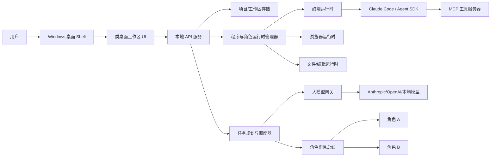

# CosS 类桌面 AI 协作工作区技术方案

版本：v0.1  
日期：2026-06-25  
适用范围：Windows 桌面端 MVP 到 Beta 阶段

## 1. 产品定位

CosS 是一个面向 AI 编程与自动化任务的 Windows 桌面工作台。用户通过左侧“项目”创建项目，每个项目启动一个独立的类桌面工作区。工作区中可以创建终端、浏览器、文件、任务等程序，但用户看到的重点不是程序本身，而是“角色”：前端工程师、后端工程师、测试工程师、产品经理、架构师等。

角色之间可以通讯、协同和分工。当用户在桌面中创建任务时，系统调用大模型进行任务拆解，把子任务分派给合适的角色程序执行，并通过程序右下角的圆形状态图标提醒用户该角色正在与哪些角色协作。

## 2. 核心概念

### 2.1 Project 项目

项目是最高层的业务容器，包含：

- 项目元数据：名称、路径、描述、创建时间、最近访问时间。
- 工作区状态：桌面布局、窗口位置、程序列表、角色列表。
- 文件与代码仓库：本地目录、Git 信息、依赖环境。
- AI 配置：默认模型、角色模板、权限策略、MCP 工具配置。
- 任务历史：任务、子任务、消息、执行日志、产物。

### 2.2 Workspace 工作区

每个项目对应一个独立的类桌面工作区。用户创建或打开项目时，工作区进入“开机”流程：

1. 加载项目配置。
2. 恢复桌面背景、Dock、窗口布局。
3. 启动项目级本地服务和消息通道。
4. 恢复上次保留的角色程序，或进入空桌面。
5. 将工作区状态标记为 online。

工作区不是完整虚拟机，而是一个应用内的虚拟桌面运行时。它需要做到项目隔离、窗口隔离、会话隔离和任务隔离。

### 2.3 Program 程序

程序是工作区中的可视化窗口，例如：

- 终端程序
- 浏览器程序
- 文件编辑程序
- 任务面板程序
- 日志/监控程序
- 数据库/接口调试程序

程序可以支持多个角色。例如“终端程序”可以被创建为前端工程师终端、后端工程师终端、测试工程师终端；“浏览器程序”可以被创建为前端预览浏览器、测试验证浏览器、资料检索浏览器。

### 2.4 Role 角色

角色是 AI 协作的基本单位。用户在工作区中主要看见和操作角色。

每个角色包含：

- 角色名称：前端工程师、后端工程师、测试工程师等。
- 角色职责：负责的任务类型和边界。
- 运行载体：终端、浏览器、文件编辑器或后台 Agent。
- 模型配置：模型供应商、模型名、温度、上下文策略。
- 工具权限：可读写文件、可运行命令、可访问网络、可调用 MCP。
- 工作目录：默认项目路径或子模块路径。
- 通讯状态：正在与哪些角色交流、当前协同任务是什么。

### 2.5 Task 任务

任务可以由用户右键桌面创建，也可以由角色主动派生。任务创建后进入调度流程：

1. 用户输入任务目标。
2. 任务规划器调用大模型生成任务拆解。
3. 系统生成子任务 DAG 或任务队列。
4. 调度器选择角色并分派子任务。
5. 角色执行并上报进度、日志、产物和阻塞点。
6. 任务协调器汇总结果，必要时发起多角色讨论。
7. 用户在任务面板查看最终结果和可操作产物。

## 3. 关键用户流程

### 3.1 创建项目并启动工作区

用户点击左侧“项目” -> “新建项目”，填写项目名称和本地路径。系统创建项目记录和目录结构，然后切换到该项目的工作区页面。工作区展示开机动画或启动状态，完成后进入类桌面。

需要的能力：

- 项目创建向导。
- 本地文件夹选择。
- 项目元数据持久化。
- 工作区启动状态机。
- 多项目切换与资源回收。

### 3.2 在桌面右键创建角色程序

用户在桌面空白处右键，选择“新建终端”。系统弹出角色选择器，例如：

- 前端工程师
- 后端工程师
- 测试工程师
- DevOps 工程师
- 架构师
- 自定义角色

用户选择后，系统创建一个绑定角色的终端窗口。若该角色需要 Claude Code，则启动 Claude Code 会话或 Agent SDK 会话，并把终端作为可视化输入输出界面。

### 3.3 创建任务并自动拆分

用户右键桌面选择“新建任务”，输入“实现用户登录页面并接入后端接口”。任务规划器分析当前项目上下文，拆分为：

- 产品/架构角色：确认需求和接口边界。
- 前端角色：实现登录页面和表单校验。
- 后端角色：实现登录接口或适配现有接口。
- 测试角色：编写用例并验证流程。

调度器把任务分发给对应角色。每个角色窗口右下角的圆形图标显示协作状态，例如前端工程师正在与后端工程师和测试工程师协作。

## 4. 推荐技术架构

### 4.1 总体架构

建议采用“桌面 Shell + 本地服务 + Agent 运行时 + 消息总线”的架构。



### 4.2 桌面端框架

推荐优先选择 Electron，原因是：

- 需要稳定的 Windows 桌面壳、系统菜单、托盘、窗口控制和自动更新。
- 需要运行 Node.js 侧进程，方便接入 node-pty、Claude Code CLI、Git、包管理器等开发工具。
- 需要 Chromium 级 WebView 能力，用于内嵌浏览器、工作区 UI 和调试工具。
- Electron 的 BrowserWindow、WebContentsView、session partition、IPC、preload/contextIsolation 机制适合做多窗口、多程序、隔离会话。

备选方案是 Tauri。Tauri 更轻、更安全、包体更小，但复杂终端、Claude Code 进程管理、Node 生态工具集成会增加 Rust 与 sidecar 维护成本。MVP 阶段建议先用 Electron 提高交付速度；若后期对包体、内存、安全沙箱要求更高，再评估 Tauri 版本。

### 4.3 前端 UI 技术

推荐：

- React + TypeScript：构建工作区、窗口系统、任务面板、角色面板。
- Zustand 或 Redux Toolkit：管理桌面窗口状态、角色状态、任务状态。
- TanStack Query：管理本地 API 请求与缓存。
- Tailwind CSS 或 CSS Modules：快速实现统一视觉系统。
- Framer Motion：实现开机、窗口拖动、任务状态等动效。
- React DnD 或自研 Pointer Events：实现桌面窗口拖拽、缩放、吸附。

类桌面工作区建议自研一个轻量 Window Manager，而不是直接使用复杂第三方桌面组件。核心需要：

- 窗口创建、关闭、最小化、最大化。
- z-index/focus 管理。
- 拖拽与缩放。
- 桌面右键菜单。
- Dock/任务栏。
- 窗口布局持久化。
- 程序角标与协作状态渲染。

### 4.4 终端技术

推荐组合：

- xterm.js：前端终端渲染。
- node-pty：Node 主进程或本地服务中创建伪终端。
- Windows ConPTY：Windows 10 1809+ 的底层伪终端能力，由 node-pty 使用。
- WebSocket 或 Electron IPC：传输终端输入输出流。

每个终端角色启动时由 RuntimeManager 创建一个 pty session：

```text
RoleProfile -> TerminalRuntime -> node-pty -> shell/claude-code -> xterm.js
```

普通终端角色可以启动 PowerShell、cmd、Git Bash 或 WSL。Claude Code 角色可以启动 Claude Code CLI，或由 Agent SDK 托管执行，再把关键事件同步到终端视图。

### 4.5 Claude Code 与 Agent 运行时

建议把 Claude Code 分为两种接入模式：

#### 模式 A：可视化终端模式

适合 MVP 和用户可观察场景。系统启动 Claude Code CLI，用户能看到类似真实终端的输出。

优点：

- 用户容易理解。
- 与原型图一致。
- 可以快速落地。

风险：

- 自动化控制 CLI 文本交互较脆弱。
- 结构化事件、任务状态、权限管理不够清晰。

#### 模式 B：Agent SDK 托管模式

适合正式的任务拆解、角色调度和自动执行。系统使用 Claude Agent SDK 创建可编程 Agent，拿到结构化消息、工具调用、成本、日志和状态。

优点：

- 更适合角色协作和任务编排。
- 更容易做权限、日志、重试、暂停、恢复。
- 可以让终端变成“观察窗口”，而不是唯一控制通道。

建议路线：

- MVP：先实现 Claude Code CLI 终端角色。
- Alpha：引入 Agent SDK 托管角色执行。
- Beta：终端 UI 与 Agent SDK 事件流统一，用户既能看见终端，也能获得结构化任务状态。

### 4.6 MCP 工具层

MCP 用于让角色访问外部工具和项目能力，例如：

- GitHub/GitLab
- Jira/Linear
- 数据库
- 文件系统
- 浏览器自动化
- 测试工具
- CI/CD
- 文档库

建议每个项目维护一份 MCP 配置，角色按权限选择可用 MCP 工具。不要让所有角色默认拥有全部工具。

### 4.7 大模型网关

需要一个统一 LLM Gateway，屏蔽不同供应商差异：

- Anthropic Claude
- OpenAI
- Gemini
- 本地模型

LLM Gateway 负责：

- Prompt 模板管理。
- 流式输出。
- 工具调用抽象。
- 成本统计。
- 请求重试和限流。
- 模型降级。
- 敏感信息过滤。

任务拆解、角色讨论、总结报告都应通过 LLM Gateway，而不是 UI 直接调用模型 API。

### 4.8 消息总线与角色通讯

角色通讯不建议用简单函数调用，应采用事件驱动模型。

推荐：

- 本机单用户 MVP：SQLite + 进程内 EventEmitter/NATS-lite/RxJS Subject。
- 多进程稳定版：Redis Streams、NATS 或 RabbitMQ。
- 云端协作版：NATS、Kafka、Temporal/队列服务。

消息类型：

```ts
type RoleMessage = {
  id: string;
  projectId: string;
  workspaceId: string;
  taskId?: string;
  fromRoleId: string;
  toRoleIds: string[];
  kind: "chat" | "handoff" | "question" | "result" | "status" | "tool_event";
  content: string;
  metadata: Record<string, unknown>;
  createdAt: string;
};
```

右下角圆形协作图标的数据来自消息总线的实时状态聚合：

- 当前角色正在发送消息给谁。
- 当前角色正在等待谁。
- 当前角色与谁属于同一个任务组。
- 当前角色最近 N 分钟协同过哪些角色。
- 是否存在阻塞、失败、等待用户确认。

### 4.9 任务编排器

TaskOrchestrator 是系统核心。它负责把用户自然语言任务变成多角色工作流。

模块拆分：

- Task Intake：接收用户任务。
- Context Collector：收集项目文件、Git 状态、已有角色、运行程序。
- Planner：调用大模型拆解任务。
- Role Matcher：按职责和能力选择角色。
- Dispatcher：分派子任务。
- Supervisor：监督执行、重试、暂停、取消。
- Reviewer：汇总结果，触发测试或代码审查。
- Artifact Manager：保存产物、补丁、报告、截图。

任务结构建议：

```ts
type TaskPlan = {
  id: string;
  title: string;
  goal: string;
  status: "draft" | "running" | "blocked" | "done" | "failed" | "cancelled";
  subtasks: Array<{
    id: string;
    title: string;
    roleType: string;
    dependencies: string[];
    acceptanceCriteria: string[];
  }>;
};
```

### 4.10 数据存储

本地优先建议：

- SQLite：项目、工作区、角色、任务、消息、日志索引。
- 文件系统：项目文件、附件、截图、导出报告。
- JSON/YAML：角色模板、项目配置、MCP 配置。
- 向量数据库可选：用于项目长期记忆和文档检索，MVP 可暂不引入。

目录建议：

```text
CosSData/
  projects/
    {projectId}/
      project.json
      workspace.json
      roles/
      tasks/
      artifacts/
      logs/
      mcp.json
  app.db
  cache/
```

### 4.11 后端/本地服务技术

MVP 可把后端服务放在 Electron main process 中，但建议尽早拆成本地 Core Service：

- Node.js + TypeScript：最快接入 Electron、node-pty、Claude SDK 和常见工具。
- Fastify 或 Hono：提供本地 HTTP/WebSocket API。
- Prisma 或 Drizzle ORM：操作 SQLite。
- Zod：校验 API 请求、角色模板、任务计划。
- OpenTelemetry：记录模型调用、任务执行和工具调用链路。

如果后期需要更高可靠性，可以把核心调度迁移到独立服务：

- Node.js Core Service：保留生态优势。
- Rust Core Service：用于更强进程隔离和资源控制。
- Python Worker：用于 AI/数据处理脚本，但不建议作为桌面主服务。

### 4.12 浏览器程序

浏览器程序有两种实现：

- Electron WebContentsView：更贴近原生嵌入浏览器，适合 MVP。
- Playwright 控制的浏览器实例：适合 AI 自动浏览、截图、测试和表单操作。

建议：

- 用户可见浏览器：Electron WebContentsView。
- 角色自动化浏览器：Playwright + Chromium，必要时把画面流或截图同步到工作区。

每个项目和角色应使用独立 session partition，避免登录态和 Cookie 串扰。

### 4.13 安全与权限

这个产品的风险点很高，因为角色可能读写文件、运行命令、访问网络和调用外部工具。必须从 MVP 起设计权限系统。

基础策略：

- Electron renderer 禁用 nodeIntegration。
- 开启 contextIsolation 和 sandbox。
- 所有危险操作走 preload 暴露的最小 IPC API。
- 角色执行命令前进入权限判断。
- 文件写入限制在项目目录或用户授权目录。
- 网络访问、MCP、环境变量、密钥读取需要显式授权。
- 为每个角色保存工具权限和命令权限。
- 任务级别支持暂停、取消、回滚建议。

角色权限示例：

```ts
type RolePermission = {
  fileRead: "project" | "workspace" | "all" | "none";
  fileWrite: "project" | "none";
  shell: "none" | "allowlist" | "approval";
  network: "none" | "allowlist" | "full";
  mcpServers: string[];
  canTalkToRoles: string[];
};
```

## 5. 功能模块清单

### 5.1 项目模块

- 项目创建、打开、删除、归档。
- 最近项目列表。
- 项目工作区开机/关机。
- 项目配置保存与迁移。

### 5.2 桌面工作区模块

- 桌面背景。
- 右键菜单。
- Dock/任务栏。
- 窗口管理。
- 程序实例管理。
- 布局持久化。
- 工作区启动动画和状态。

### 5.3 程序与角色模块

- 程序注册表。
- 角色模板注册表。
- 程序能力与角色能力匹配。
- 创建角色程序。
- 角色状态面板。
- 角色协作角标。
- 角色通讯记录。

### 5.4 终端模块

- xterm.js 终端渲染。
- node-pty 会话管理。
- Claude Code CLI 启动。
- 终端输入输出日志。
- 终端断线恢复。
- 终端权限控制。

### 5.5 任务模块

- 右键创建任务。
- 任务拆解。
- 子任务依赖。
- 角色分派。
- 执行状态。
- 阻塞与用户确认。
- 任务结果汇总。
- 任务历史检索。

### 5.6 通讯模块

- 角色私聊。
- 多角色任务群聊。
- 系统调度消息。
- 工具事件消息。
- 消息持久化。
- 实时状态聚合。

### 5.7 模型与工具模块

- LLM Gateway。
- Claude Code / Agent SDK。
- MCP 配置。
- 工具权限。
- 成本统计。
- 调用日志。

## 6. MVP 技术栈建议

| 层级 | 推荐技术 | 用途 |
|---|---|---|
| 桌面壳 | Electron | Windows 桌面应用、窗口、系统集成 |
| UI | React + TypeScript | 类桌面工作区和业务界面 |
| 状态管理 | Zustand | 窗口、角色、任务状态 |
| 终端 UI | xterm.js | 渲染终端 |
| 伪终端 | node-pty | 启动 PowerShell/Claude Code |
| 本地 API | Fastify + WebSocket | UI 与核心服务通讯 |
| 数据库 | SQLite + Drizzle | 项目、任务、消息、布局存储 |
| 校验 | Zod | 配置、API、模型输出校验 |
| Agent | Claude Code CLI + Claude Agent SDK | 角色执行与任务自动化 |
| 工具协议 | MCP | 外部工具接入 |
| 自动化浏览器 | Playwright | 测试、浏览器角色、截图 |
| 日志 | pino + OpenTelemetry | 调试、追踪、成本分析 |

## 7. 后续开发计划

### 阶段 0：产品与技术定稿，1 周

目标：把原型转成可开发规格。

交付物：

- 信息架构图。
- 核心对象模型。
- MVP 角色列表。
- 项目创建与工作区开机流程图。
- 权限策略草案。
- 技术栈最终确认。

验收标准：

- 团队能明确 Project、Workspace、Program、Role、Task 的边界。
- 能画出从创建项目到创建角色终端的完整流程。

### 阶段 1：桌面壳与项目系统，2 周

目标：完成应用基础外壳。

开发内容：

- Electron 应用骨架。
- 左侧导航与项目列表。
- 新建项目向导。
- 项目本地存储。
- 工作区开机状态机。
- 空桌面、Dock、右键菜单。

验收标准：

- 用户可创建多个项目。
- 每个项目打开后进入独立桌面。
- 关闭再打开后能恢复项目列表和基础工作区状态。

### 阶段 2：窗口系统与程序注册表，2 周

目标：让工作区能创建和管理程序窗口。

开发内容：

- 桌面窗口管理器。
- 程序注册表。
- 右键新建程序。
- 窗口拖拽、缩放、关闭、最小化。
- 布局持久化。
- Dock 中显示运行程序。

验收标准：

- 可在不同项目工作区创建不同程序。
- 窗口位置和大小可恢复。
- 程序实例与项目隔离。

### 阶段 3：角色系统与终端角色，3 周

目标：实现“程序选择角色”的核心体验。

开发内容：

- 角色模板配置。
- 创建终端时选择角色。
- xterm.js 终端窗口。
- node-pty 启动 PowerShell。
- Claude Code CLI 角色启动。
- 角色状态存储。
- 终端日志持久化。

验收标准：

- 用户能创建“前端工程师终端”“后端工程师终端”等角色终端。
- 终端能正常输入输出。
- Claude Code 终端能按角色配置启动。
- 用户能从 UI 区分程序类型和角色身份。

### 阶段 4：角色通讯与协作角标，2 周

目标：让角色之间可以通讯，并在 UI 上可见。

开发内容：

- 本地消息总线。
- 角色消息协议。
- 角色间私聊/任务消息。
- 协作状态聚合器。
- 程序右下角圆形协作图标。
- 角标详情弹层。

验收标准：

- 角色 A 能给角色 B 发送消息。
- 消息能持久化。
- 圆形图标能显示正在协作的角色数量和状态。
- 用户点击角标能看到协作对象和任务上下文。

### 阶段 5：任务创建、拆解与分派，3 到 4 周

目标：实现用户右键创建任务后自动拆解给角色。

开发内容：

- 新建任务入口。
- TaskOrchestrator。
- LLM Gateway。
- 任务拆解 Prompt。
- 角色匹配器。
- 子任务执行状态。
- 任务面板。
- 用户确认/阻塞机制。

验收标准：

- 用户输入一个任务后，系统能生成可读的任务计划。
- 系统能把子任务分派给不同角色。
- 任务执行状态能实时显示。
- 角色协作角标能随任务通讯变化。

### 阶段 6：Agent SDK 与结构化执行，4 周

目标：把角色从“可视化终端”升级为“可编排 Agent”。

开发内容：

- Claude Agent SDK 接入。
- Agent 事件流。
- 工具调用日志。
- 权限审批。
- 任务暂停/恢复/取消。
- 成本统计。
- Agent 输出同步到角色窗口。

验收标准：

- 至少一个角色可通过 Agent SDK 执行结构化任务。
- 系统能记录模型调用、工具调用和成本。
- 用户能审批高风险操作。

### 阶段 7：MCP、浏览器与测试闭环，3 到 4 周

目标：让角色能调用更多工具，并验证任务产物。

开发内容：

- MCP 配置管理。
- 浏览器程序。
- Playwright 自动化浏览器角色。
- 测试角色执行 npm/test/pytest 等命令。
- 截图和测试报告产物。

验收标准：

- 项目能配置 MCP 工具。
- 角色能调用授权工具。
- 前端任务可以由浏览器角色自动打开页面并截图验证。

### 阶段 8：Beta 稳定化，持续 4 周

目标：提升可靠性、安全性和可用性。

开发内容：

- 崩溃恢复。
- 会话恢复。
- 日志导出。
- 权限细化。
- 性能优化。
- 自动更新。
- 安装包。
- 关键路径 E2E 测试。

验收标准：

- 连续使用多个项目不串状态。
- 角色进程异常退出可提示并恢复。
- 用户可以导出任务执行报告。
- 安装包可在目标 Windows 机器正常安装运行。

## 8. 主要技术风险

### 8.1 CLI 自动化不稳定

Claude Code CLI 适合作为用户可见终端，但不适合作为长期唯一编排接口。正式任务编排应逐步转向 Agent SDK。

### 8.2 权限风险

AI 角色能执行命令和写文件，必须设计审批、白名单和项目目录限制。不要在 MVP 后期才补权限。

### 8.3 多角色协同复杂度

如果一开始做全自动多角色协同，容易失控。建议先做“任务拆解 + 用户确认 + 单步分派”，再做自动并行。

### 8.4 状态恢复复杂

窗口状态、终端状态、任务状态、消息状态需要分层持久化。不要指望通过保存 UI 状态恢复所有运行态。

### 8.5 模型成本与延迟

任务拆解、角色讨论和执行都可能调用模型。需要从第一版开始记录 token、耗时、失败率和重试次数。

## 9. 建议的 MVP 边界

第一版不要追求完整 AI 操作系统。建议 MVP 只做以下闭环：

1. 创建项目。
2. 项目启动独立工作区。
3. 桌面右键创建终端。
4. 创建终端时选择角色。
5. 角色终端可运行 Claude Code。
6. 右键创建任务。
7. 大模型拆解任务并显示计划。
8. 用户确认后把子任务分派给已有角色。
9. 角色之间产生消息记录。
10. 程序右下角角标显示协作状态。

这样能最快验证产品最独特的体验：用户不是管理一堆工具窗口，而是在一个项目桌面里管理一组会协作的 AI 角色。

## 10. 参考资料

- Electron BrowserWindow 文档：https://www.electronjs.org/docs/latest/api/browser-window
- Electron 安全文档：https://www.electronjs.org/docs/latest/tutorial/security
- Tauri 2 文档：https://v2.tauri.app/start/
- xterm.js 文档：https://xtermjs.org/docs/
- node-pty 仓库：https://github.com/microsoft/node-pty
- Claude Agent SDK 文档：https://code.claude.com/docs/en/agent-sdk/overview
- Claude Code MCP 文档：https://code.claude.com/docs/en/mcp
